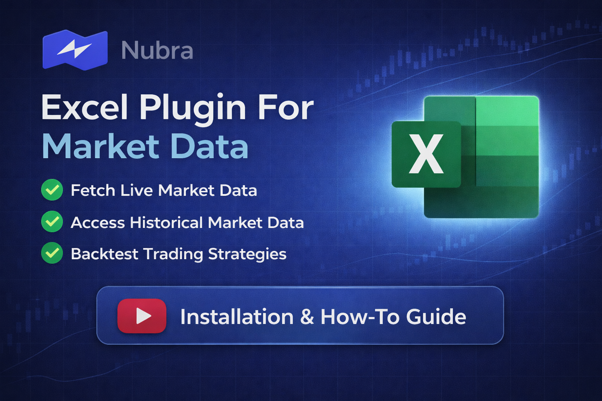

# Nubra Excel Plugin Version 1

Nubra Excel Plugin Version 1 is a Windows-based Excel add-in that lets Nubra users log in with OTP and MPIN, open live market sheets inside Excel, view positions, and build historical data sheets.

This README is written as an end-user installation and usage guide first. The technical implementation notes are kept near the bottom for reference.

## Watch The Full Setup Video

[](https://drive.google.com/file/d/1GQuqiBg8c96z_3vCJaZgwPPsqSJMWkBN/view)

Prefer a walkthrough first? Watch the complete Version 1 setup video here:

- [Open the setup video on Google Drive](https://drive.google.com/file/d/1GQuqiBg8c96z_3vCJaZgwPPsqSJMWkBN/view)

## Installation Methods

You can start Nubra Excel Plugin Version 1 in two ways:

- Recommended for most users: use the packaged `.exe` launcher
- Fallback for developers or troubleshooting: use the PowerShell and npm setup flow

## What Version 1 Includes

- OTP + MPIN authentication
- UAT and PROD environment switch
- `Instruments` sheet sync
- `LivePrices` sheet
- `LiveOptionChain` sheet
- `Master` sheet that combines active live streams
- `Positions` sheet
- `Historical` sheet with chart creation

## Before You Start

Make sure you have:

- Windows
- Microsoft Excel desktop installed
- Node.js and npm installed
- A Nubra account with phone number, OTP access, and MPIN
- Internet access

For the current Version 1 package, `NubraExcelLauncher.exe` is not a fully standalone installer. It works correctly when these prerequisites are already available on the machine.

## Recommended Installation Using The EXE

### Step 1: Open the Release Package

Use the packaged release folder or ZIP that contains:

- `NubraExcelLauncher.exe`
- `setup-local.ps1`
- `start-all.ps1`
- `stop-all.ps1`
- `manifest.xml`
- the plugin web assets and icons

If you are using the ZIP package, extract it first. Do not run the launcher from inside the ZIP.

### Step 2: Run `NubraExcelLauncher.exe`

Double-click:

```text
NubraExcelLauncher.exe
```

The launcher is designed to:

- request administrator access if Windows requires it
- run the one-time setup
- start the local Nubra Excel Plugin services
- sideload the add-in into Excel

If Node.js, npm, and Excel desktop are already installed, running this EXE from the extracted package is the main step the user needs.

### Step 3: If Windows Protects Your PC, Click `More info` And Continue

On some systems, Windows Defender SmartScreen may show a message like:

```text
Windows protected your PC
```

If this appears:

1. Click `More info`
2. Click `Run anyway` or the available continue option

This can happen because the launcher is an internal or newly packaged EXE and may not yet be recognized by SmartScreen.

### Step 4: Allow Setup To Complete

During the first launch, the EXE will run the same setup used by the manual flow. This may:

- install npm packages
- install and trust the Office development certificate
- enable Office loopback access
- register and sideload the add-in

Important:

- Windows may show a User Account Control prompt
- allow the prompt so setup can finish correctly
- the first run may take longer than later runs

After this completes, the plugin is ready to open in Excel.

### Step 5: Open Excel And The Nubra Add-in

After setup completes, Excel should open with the plugin available.

If the task pane does not appear automatically:

1. Open Excel
2. Go to the `Home` tab
3. Find the `Nubra` group
4. Click `Open Nubra Plugin`

### Step 6: Reopen The Plugin Later

For future launches, open the same extracted folder and run:

```text
NubraExcelLauncher.exe
```

The launcher will start the plugin again and reuse the same setup flow.

### Step 7: Stop The Plugin

To stop the plugin and unregister the sideloaded add-in, run the stop script from the same extracted folder:

```powershell
powershell -ExecutionPolicy Bypass -File .\stop-all.ps1
```

If you prefer terminal commands and are already inside the project folder, you can also use:

```powershell
npm run stop
```

## Advanced Manual Setup (Fallback)

Use this section only if the `.exe` launcher does not work, or if you want to run the plugin directly from the source project.

### Step 1: Download the Project

Clone this repository, or download and extract the ZIP into a local folder.

```powershell
git clone https://github.com/socials-zanskar/nubra-excel-plugin.git
cd nubra-excel-plugin
```

### Step 2: Open PowerShell in the Project Folder

Open PowerShell in the root folder of the project, where `package.json` is located.

### Step 3: Run One-Time Setup

Run the following command:

```powershell
npm run setup
```

This one-time setup:

- installs npm packages if needed
- installs and trusts the Office development certificate
- enables loopback for Office
- prepares sideloading for the Excel add-in

Important:

- Windows may ask for administrator permission during setup
- allow the prompt so the loopback and Office setup can complete successfully

### Step 4: Start the Plugin

Run:

```powershell
npm run start
```

This command:

- starts the local HTTPS dev server at `https://localhost:3000`
- registers the add-in manifest
- sideloads the add-in into Excel

### Step 5: Wait for Excel to Open

After startup finishes, Excel should open with the Nubra add-in available.

If the task pane does not open automatically:

1. Open Excel
2. Go to the `Home` tab
3. Look for the `Nubra` group
4. Click `Open Nubra Plugin`

## First-Time Login Guide

### Step 1: Choose the Environment

At the top of the plugin, select either:

- `UAT` for testing
- `PROD` for live usage

### Step 2: Enter Your Phone Number

Type your 10-digit mobile number in the `Phone` field.

If your login flow requires it, you can also use the `Skip TOTP route` checkbox.

### Step 3: Send OTP

Click:

```text
1) Send OTP
```

You should receive an OTP on your registered mobile number.

### Step 4: Verify OTP

Enter the 6-digit OTP and click:

```text
2) Verify OTP
```

After successful verification, the plugin will move you to the MPIN step.

### Step 5: Verify MPIN and Log In

Enter your 4-digit MPIN and click:

```text
3) Verify MPIN (Login)
```

After login:

- the authentication badge will change to authenticated
- the plugin can prepare data sheets
- the `Instruments` sheet may be synced automatically

## How to Use the Plugin

### Live Prices

To start live prices:

1. Open `Live Prices WebSocket`
2. Enter one or more symbols separated by commas
3. Select exchange
4. Select interval
5. Click `Start Live Prices WS`

This creates or refreshes the `LivePrices` sheet in Excel.

### Live Option Chain

To start live option chain data:

1. Open `Live Option Chain WebSocket`
2. Enter the asset, for example `NIFTY` or `BANKNIFTY`
3. Enter expiry in `YYYYMMDD` format
4. Select exchange
5. Select interval
6. Click `Start Live Option Chain WS`

This creates or refreshes the `LiveOptionChain` sheet.

### Master Sheet

The `Master` sheet combines active live streams into one working view.

To use it:

1. Start `Live Prices`
2. Start `Live Option Chain`
3. Open `Master WebSocket`
4. Review the projected data inside the `Master` sheet

### Positions

To build the positions sheet:

1. Open `Positions (REST)`
2. Click `Build/Refresh Positions Sheet`

This creates or refreshes the `Positions` sheet.

### Historical Data

To build historical data and chart:

1. Open `Historical Data (REST)`
2. Enter the stock, index, or option symbol
3. Select type
4. Select exchange
5. Choose start date and end date
6. Select interval
7. Click `Build Historical Sheet + Chart`

This creates a historical worksheet and chart in Excel.

## Excel Sheets Created by the Plugin

Depending on what you use, the plugin can create these sheets:

- `Instruments`
- `LivePrices`
- `LiveOptionChain`
- `Master`
- `Positions`
- `Historical`

## Stop the Plugin

If you started the plugin using the extracted EXE package, stop it with:

```powershell
powershell -ExecutionPolicy Bypass -File .\stop-all.ps1
```

If you started it from the source project using npm, run:

```powershell
npm run stop
```

Both options remove the sideloaded add-in and stop the local dev server.

## Troubleshooting

### Setup asks for admin permission

This is expected on the first EXE launch and during `npm run setup`. The setup flow needs elevated rights to configure Office loopback access.

### Excel opens but the plugin is missing

Try these checks:

- confirm the EXE setup completed without errors
- make sure Excel desktop is installed
- open Excel and check `Home > Nubra > Open Nubra Plugin`
- close Excel and run `NubraExcelLauncher.exe` again
- if needed, use the manual fallback steps and run `npm run stop` followed by `npm run start`

### Localhost certificate warning

Run the EXE again or use `npm run setup`, and allow the Office certificate installation prompt.

## Technical Notes

These notes are kept for developers and maintainers.

- No Python runtime is required
- Local server runs on `https://localhost:3000`
- Auth uses OTP and MPIN flow
- Session tokens are stored in browser local storage for MVP convenience
- `x-device-id` is generated once and reused
- Main REST and WebSocket integrations target Nubra UAT and production APIs

### Endpoints Used

- Auth REST: `sendphoneotp`, `verifyphoneotp`, `verifypin`
- Refdata REST: `refdata/refdata/{date}?exchange=...`
- Positions REST: `portfolio/positions`
- Local WS bridge: `/ws/start`, `/ws/events`, `/ws/stop`, `/ws/status`
- Nubra WS targets: `wss://api.nubra.io/apibatch/ws`, `wss://uatapi.nubra.io/apibatch/ws`
