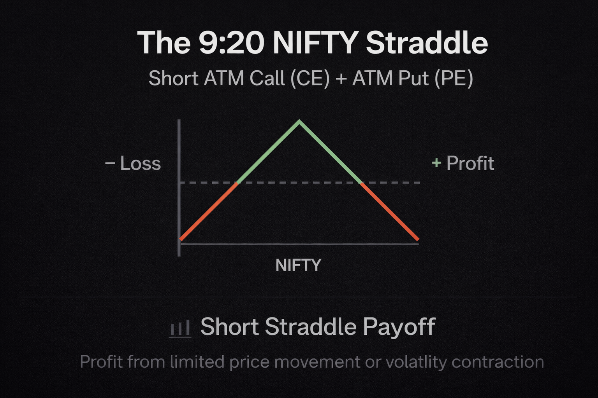

  

## What Is the 9:20 Straddle?

The **9:20 straddle** is a popular **intraday options strategy** where traders:

- **Short (sell) one ATM Call (CE) and one ATM Put (PE)** on an index  
- **Enter the trade at 9:20 AM**, slightly after market open  
- **Exit at a fixed time** (e.g., 3:00 PM) or if a stop-loss is hit

The goal is to capture **option premium decay** if the market stays within a range.

---

## Why Enter at 9:20 AM?

Entering right at the open (9:15 AM) is often risky due to:

- High volatility  
- Wide bid-ask spreads  
- News-driven gaps  

By 9:20 AM, spreads usually tighten, and the market starts to settle—leading to cleaner entries and fewer execution errors.

---

## How the Short Straddle Works

Basic trade setup:

- **Time of Entry**: 9:20 AM  
- **Action**:  
  - Sell 1 lot of ATM CE  
  - Sell 1 lot of ATM PE  
- **Exit**:  
  - Fixed time (e.g., 3:00 PM)  
  - Or if stop-loss hits on either leg (e.g., 25% per leg)

> This is a **short straddle**, designed to profit from range-bound movement and time decay (theta).

---

## Example (Generic)

At 9:20 AM, the index is at **22,000**:

- Sell ATM CE at ₹100  
- Sell ATM PE at ₹105  
- Total premium collected = ₹205  

If both decay to ₹30 each by close:
- Net gain = (205 - 60) × lot size

Add stop-loss:
- SL hits if either leg rises 25% (e.g., ₹125–₹131.25)

---

## When It Works Well

- Market stays within a narrow range  
- Implied volatility drops through the day  
- No major news or economic data  
- Slow, sideways price action

You keep the premium as both options lose value.

---

## When It Fails

- Trending or directional markets  
- Sudden news or data surprises  
- Volatile sessions (expiry, events, etc.)

The market moves strongly in one direction, and one leg spikes, leading to large losses unless stop-losses are enforced.

---

## Common Strategy Add-ons

- 25% stop-loss per leg  
- Trail SL once MTM profit hits a level  
- Exit early if profit meets target  
- Hedge with far OTM options  
- Re-entry logic after SL

These help manage risk and reduce extreme losses.

---

## Backtesting the 9:20 Straddle

Before going live, test with:

- Historical option data (CE/PE prices at 9:20 and throughout the day)  
- Simulate entry/exit conditions  
- Apply SLs and re-entries (if any)  
- Metrics to analyze:  
  - Win/loss rate  
  - Maximum drawdown  
  - Average return per day  
  - Risk-reward consistency  

Backtest across different environments: trend, expiry, news, low-IV days.

---

## Automating the Strategy

Because timing and SLs are critical, many traders automate this strategy.

### Benefits of Automation:

- Precise 9:20 AM entry  
- Instant stop-loss execution  
- Eliminate human emotion  
- Enable re-entry or trailing logic  
- Central logging for analysis

Using UAT environments like Nubra’s lets you:

- Test the strategy in live market conditions with virtual capital  
- Safely simulate order logic  
- Refine before going fully live

---

## Pros and Cons

| ✅ Pros                       | ⚠️ Cons                            |
|-------------------------------|-------------------------------------|
| Simple and rules-based         | Can suffer heavy losses on trends   |
| Easy to backtest and simulate  | Needs strict SL and risk controls   |
| Can be automated fully         | Sensitive to news/IV spikes         |
| Works well in calm markets     | Requires consistent discipline      |

---

## Final Takeaway

The 9:20 straddle is one of the most used intraday options strategies in India—for good reason.

It’s structured, time-based, and rule-driven.

But it’s not without risk.  
The real edge comes from how well you execute it:

- Follow SL rules  
- Automate where possible  
- Test with UAT or paper before going live  
- Log every trade and review it  

It's not just about timing the trade—it's about **owning the process**.

---

## Watch the 9:20 Straddle in Action

  <video width="100%" autoplay loop muted controls>
    <source src="./assets/9_20.mp4" type="video/mp4">
    Your browser does not support the video tag.
  </video>

