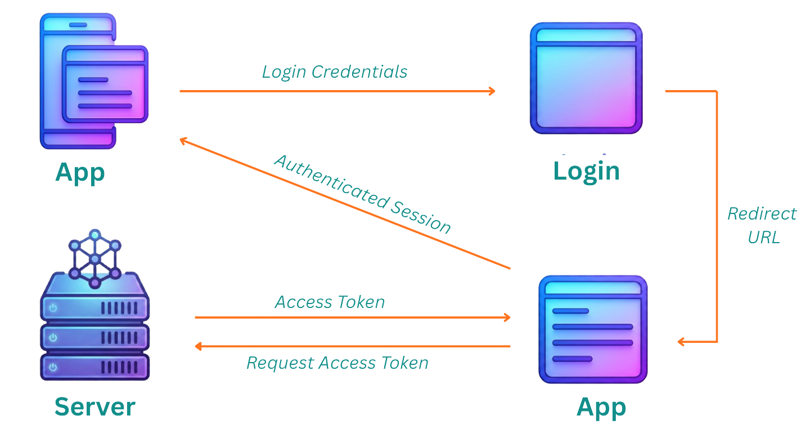
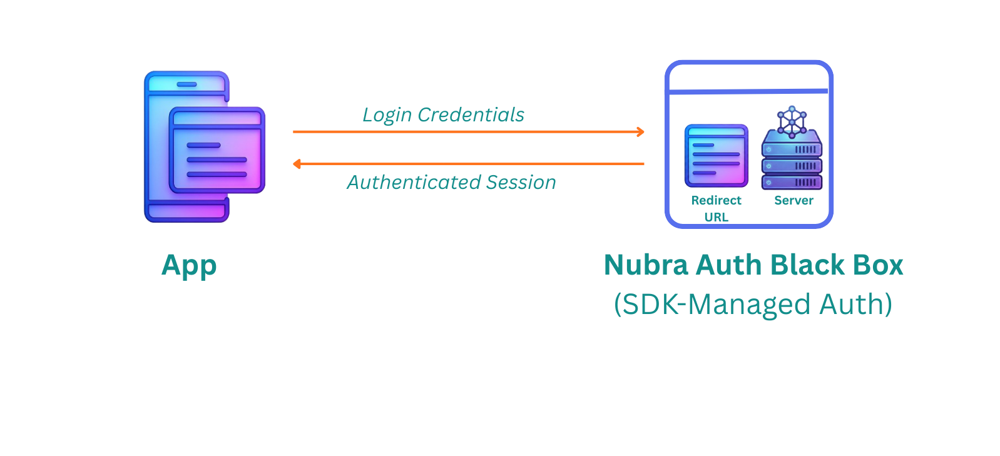

## What Is Authentication?

At its core, **authentication** is the process of proving identity.

In trading systems, authentication answers one critical question:

> **Who is placing this order — and are they allowed to?**

Every action in a trading system — fetching prices, placing orders, modifying positions — must be tied back to a verified identity.

Without authentication:
- Orders cannot be routed
- Accounts cannot be accessed
- Capital cannot be protected

---

## Why Authentication Matters in Algo Trading

In manual trading, authentication happens once — when a trader logs into a broker terminal.

In **algorithmic trading**, authentication must work very differently.

An algo is expected to:
- Run unattended
- Restart automatically after failures
- Execute from servers or cloud environments
- Recover cleanly after network or system downtime

This is only possible if authentication is:
- Scriptable
- Predictable
- Secure
- Free from manual intervention

Without this, **true automation breaks**.

---

## The Problem With Traditional Broker Authentication

Most brokers were built for **human traders**, not autonomous systems.

  

### Typical Broker Login Flow

- Username & password entry
- CAPTCHA verification
- OTP sent to phone or email
- Browser-based redirects
- Manual approvals at market open

### Why This Breaks Automation

- ❌ Requires human presence
- ❌ Cannot run headless on servers
- ❌ Breaks on restarts
- ❌ Impossible to recover automatically
- ❌ Fails in CI/CD or containerized environments

This means:
> Even the best strategy becomes unreliable if it cannot log in consistently.

---

## What SEBI Says About Authentication (High-Level View)

From a regulatory standpoint, **SEBI mandates strong authentication** to ensure:

- Only authorized users access trading systems
- Orders are traceable to a verified client
- Unauthorized or fraudulent access is prevented
- Systems follow audit and compliance standards

SEBI does **not** mandate *how* automation must be built — but it expects:
- Secure credential handling
- Non-repudiation of trades
- Clear ownership of every order placed

This places responsibility on trading platforms to design authentication that is:
- Secure
- Deterministic
- Auditable
- Suitable for automated execution

---

## Why Authentication Is the Foundation of Automation

No matter how advanced your strategy is:
- ORB
- Options selling
- Market making
- Arbitrage

It **cannot operate independently** unless authentication is reliable.

A system that:
- Fails to log in at 9:15
- Needs OTP re-entry after a crash
- Breaks on server restart

…is not truly algorithmic.

It’s just **manual trading with code attached**.

---

## Nubra’s Authentication Philosophy

Nubra was designed with **automation-first thinking**.

  

### Key Characteristics

- Single, streamlined authentication flow
- Managed entirely via the Nubra SDK
- No browser redirects
- No captchas
- No manual approvals at runtime

### Why This Matters

- Works reliably on:
  - Local machines
  - Servers
  - Cloud environments
  - CI/CD pipelines
- Supports:
  - Auto-restarts
  - Crash recovery
  - Scheduled execution
  - Headless operation

Authentication becomes **infrastructure**, not a bottleneck.

---

## Authentication Enables Better Trading Systems

When authentication is predictable, traders can focus on:

- Strategy logic
- Risk management
- Monitoring and alerts
- Performance analysis

Instead of:
- Logging in repeatedly
- Babysitting sessions
- Worrying about session expiry

Good authentication reduces **operational risk**, not just security risk.

---

## Important Disclaimer

> ⚠️ **Educational Use Only**
>
> This blog is shared strictly for **learning and educational purposes**.
>
> - It is not financial advice  
> - It does not replace regulatory or legal guidance  
> - Traders should always follow broker terms, exchange rules, and applicable regulations  
>
> Authentication mechanisms must be used responsibly and in compliance with broker and regulatory requirements.

---

## Final Thoughts

Most traders focus on strategies.  
Experienced traders focus on **systems**.

Authentication is not a checkbox — it is the **foundation** on which reliable automation is built.

If your system cannot authenticate itself cleanly:
- It cannot scale
- It cannot recover
- It cannot run unattended

In algorithmic trading, **true automation begins with authentication**.
