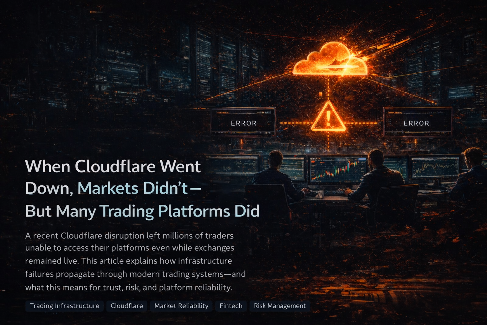
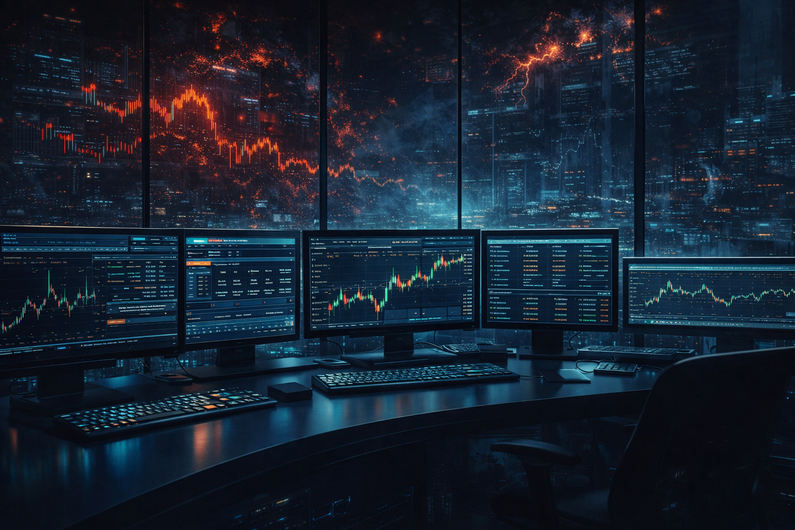

### When Infrastructure Fails, Traders Feel It First

On volatile market days, traders expect uncertainty from price movement — not from the systems they rely on.

Yet during a recent Cloudflare service disruption, that expectation was broken.

Across regions, traders reported:
- Broker login pages not loading  
- Dashboards freezing  
- APIs returning timeouts  
- Orders that could not be monitored  

All of this happened while **the stock exchanges themselves were still running normally**.

The issue was not the market.  
It was the infrastructure between traders and the market.

---

## What Happened During the Cloudflare Event

Cloudflare operates one of the largest traffic and security layers on the internet. It sits between users and applications, providing:

- Traffic routing  
- DDoS protection  
- Web security  
- Content delivery  

A large number of fintech platforms, brokers, and trading tools rely on Cloudflare as their first line of access.

When Cloudflare experienced service degradation, many of these platforms became unreachable — even though their backend systems and the exchanges were still live.

This is why traders could not log in, even while prices continued to move.

---

## How a Single Infrastructure Layer Affected Millions of Traders

Most modern trading platforms follow this structure:

Trader → CDN / Security Layer → Broker Platform → Exchange

When the CDN and security layer fails:

- Broker UIs go dark  
- Trading dashboards disappear  
- APIs stop responding  
- Risk visibility vanishes  

For a trader, this means:

- You cannot see open positions  
- You cannot hedge  
- You cannot exit  
- You cannot manage risk  

Even a few minutes of lost access during volatility can result in forced exposure and financial loss.

In trading, availability is not convenience.  
It is **risk control**.

---

## Nubra Remained Live During the Outage

During the Cloudflare disruption, Nubra publicly confirmed that its platform continued operating normally.

**Official update:**  
https://x.com/nubra_io/status/1996883319225831577  

> *“Even on the toughest days — when others slow down — Nubra is still ON, ticking.”*

<video autoplay muted loop playsinline preload="auto" poster="./assets/nubra-cloudflare-status.svg">
	<source src="./assets/cloudflare-status.mp4" type="video/mp4">
	Your browser does not support the video tag. The Nubra status image will be shown instead.
</video>

This update was issued while many platforms were experiencing access failures — providing real-time confirmation that traders on Nubra were not impacted by the Cloudflare event.

---

## Why These Outages Damage More Than Uptime

Traders don’t just trade with capital — they trade with confidence.

They can accept:
- A learning curve  
- A missing feature  
- A delayed UI update  

But they don’t forget:
- Being locked out during volatility  
- Not knowing whether their order executed  
- Watching the market move while their screen is frozen  

Infrastructure failures create **trust failures**.

Once that trust is shaken, traders begin re-evaluating where they trade.

---

## The Structural Risk in Modern Trading Platforms

The Cloudflare outage exposed something deeper than a temporary disruption.

It revealed how many platforms depend on the same centralized infrastructure layers.

This creates:
- Shared failure points  
- Systemic downtime  
- Simultaneous outages across competing brokers  

In financial markets, where milliseconds matter,  
**infrastructure resilience becomes part of the trading system itself.**

---

## Final Takeaway

Markets will always be volatile.  
Platforms should not be.

The Cloudflare event showed how quickly millions of traders can lose access — not because exchanges failed, but because the path to those exchanges did.

When the next high-volatility day arrives, traders will remember which platforms stayed accessible — and which ones disappeared behind a loading screen.

