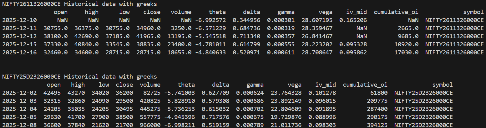

## Why Historical Expired Options Data Matters

In options trading, **what happens after expiry is just as important as what happens before it**.

Most traders focus only on live option chains. While that may work for discretionary trading, it breaks down when you want to **systematically design, test, and scale options strategies**.

Historical APIs that provide **expired options data along with Greeks** unlock insights such as:

- How premiums decayed into expiry  
- How Greeks evolved in the final days  
- How volatility collapsed post-expiry  
- How different strikes behaved across market regimes  

If your goal is data-driven strategy building, **expired options data is not optional — it is foundational**.

---

## Backtesting: The Core of Strategy Development

To truly build an options strategy, **backtesting is mandatory**.

Backtesting allows you to:

- Validate ideas across **multiple years and market conditions**
- Measure **risk, drawdowns, and expectancy**
- Separate **edge from randomness**
- Test exit logic, roll rules, and sizing

However, meaningful options backtesting **requires historical data for contracts that no longer exist**.

Without expired options data:
- You cannot analyze behavior **into expiry**
- You miss how **Greeks decay and explode**
- You cannot evaluate final settlement outcomes

This is why historical expired options APIs are essential for serious traders.

---

## Why Post-Expiry Greeks Are So Important

Greeks are dynamic — they **change rapidly as expiry approaches**.

By studying Greeks on expired contracts, traders gain insight into:

- **Theta acceleration** in the final days  
- **Gamma expansion** near ATM strikes  
- **Delta convergence** to 0 or 1  
- **Vega collapse** regardless of implied volatility  

These insights help answer critical questions:

- Was P&L driven by **direction, volatility, or time decay**?
- How close to expiry does **gamma risk become unacceptable**?
- Do **weekly expiries behave differently** from monthly ones?

These answers only come from **post-expiry historical analysis**.

---

## Understanding the Greeks (and How Traders Use Them)

### Delta (Δ) – Directional Sensitivity
Measures how much an option’s price changes for a one-point move in the underlying.

**Used to:**
- Control directional exposure  
- Build delta-neutral strategies like straddles and spreads  

---

### Gamma (Γ) – Delta Acceleration
Measures how quickly delta changes as the underlying moves.

**Used to:**
- Identify explosive risk zones near expiry  
- Manage intraday and expiry-day adjustments  

---

### Theta (Θ) – Time Decay
Measures how much value an option loses each day.

**Used to:**
- Design premium-selling strategies  
- Compare decay profiles across strikes and expiries  

---

### Vega (V) – Volatility Sensitivity
Measures sensitivity to changes in implied volatility.

**Used to:**
- Trade volatility expansion or contraction  
- Avoid selling options when IV is underpriced  

---

### Implied Volatility (IV)
Represents the market’s expectation of future movement.

**Used to:**
- Compare IV to realized volatility  
- Time entries around events and expiries  

Studying how these Greeks behaved **historically — especially into expiry — enables evidence-based strategy design**.

---

## Learn More About Options Strategy Construction

To see how Greeks come together in real trading strategies, explore the strategy resources on **nubra.io**.

These cover:
- Multi-leg options strategies  
- Risk and payoff structures  
- Greek exposure across market conditions  

They pair naturally with historical expired options data.

---

## Fetching Expired Option Greeks Using Nubra’s Historical Data API

Below is an example showing how to fetch **historical price data and Greeks for expired option contracts** using Nubra’s API.

### Instrument Naming Format (Current Year)

For current-year option contracts, the format is:

UNDERLYING + YEAR + MONTH_NUMBER + DAY + STRIKE + CE/PE

**Examples:**
- NIFTY2611326000CE  
- NIFTY25D2326000CE  

This format ensures contracts remain addressable **even after expiry**.

---

## Example Code: Historical Expired Options Data with Greeks

~~~python
from nubra_python_sdk.marketdata.market_data import MarketData
from nubra_python_sdk.start_sdk import InitNubraSdk, NubraEnv
import pandas as pd

pd.set_option('display.max_columns', None)
pd.set_option('display.max_rows', 1000)
pd.set_option('display.max_colwidth', None)
pd.set_option('display.width', 0)

# Initialize Nubra SDK
nubra = InitNubraSdk(NubraEnv.PROD, env_creds=True)
mdInstance = MarketData(nubra)

# Fetch historical data
instruments = ['NIFTY2611326000CE', 'NIFTY25D2326000CE']

response = mdInstance.historical_data({
    "exchange": "NSE",
    "type": "OPT",
    "values": instruments,
    "fields": [
        "open", "high", "low", "close",
        "cumulative_volume",
        "theta", "delta", "gamma", "vega",
        "iv_mid", "cumulative_oi"
    ],
    "startDate": "2025-12-01T11:01:57.000Z",
    "endDate": "2026-01-14T06:13:57.000Z",
    "interval": "1d",
    "intraDay": False,
    "realTime": False
})

def tsp_list_to_series(tsp_list):
    return pd.Series(
        data=[p.value for p in tsp_list],
        index=pd.to_datetime([p.timestamp for p in tsp_list], unit="ns")
    )

dfs = {}

for instrument_dict in response.result[0].values:
    for symbol, stock_chart in instrument_dict.items():
        df = pd.DataFrame({
            "open": tsp_list_to_series(stock_chart.open),
            "high": tsp_list_to_series(stock_chart.high),
            "low": tsp_list_to_series(stock_chart.low),
            "close": tsp_list_to_series(stock_chart.close),
            "volume": tsp_list_to_series(stock_chart.cumulative_volume),
            "theta": tsp_list_to_series(stock_chart.theta),
            "delta": tsp_list_to_series(stock_chart.delta),
            "gamma": tsp_list_to_series(stock_chart.gamma),
            "vega": tsp_list_to_series(stock_chart.vega),
            "iv_mid": tsp_list_to_series(stock_chart.iv_mid),
            "cumulative_oi": tsp_list_to_series(stock_chart.cumulative_oi),
        })
        df.sort_index(inplace=True)
        df["symbol"] = symbol
        dfs[symbol] = df

print(dfs[instruments[0]].head())
print(dfs[instruments[1]].head())
~~~

---

## Sample Output: Expired Options Historical Data with Greeks

The output below shows historical OHLC data along with option Greeks
for expired NIFTY call options, enabling post-expiry analysis and backtesting.

  

> **Figure:** Historical price data with Delta, Gamma, Theta, Vega, IV, and Open Interest for expired NIFTY options.

---

## Final Takeaway

Expired options data — especially when combined with historical Greeks — is what separates **guess-based trading from evidence-driven strategy design**.

With access to expired contracts, you can:

- Analyze Greek behavior into expiry  
- Backtest strategies accurately  
- Understand volatility and decay dynamics  
- Build confidence before deploying capital  

If you’re serious about systematic options trading, **historical expired options data isn’t a nice-to-have — it’s the foundation**.
