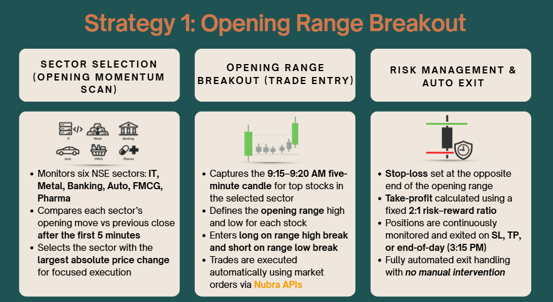

The **Opening Range Breakout (ORB)** is one of the most widely followed intraday trading strategies used by discretionary and algorithmic traders alike.

Its strength lies in **simplicity, structure, and discipline** — no complex indicators, no predictions, just price reacting to early market momentum.

This blog explains the ORB strategy conceptually and visually, to help traders **understand how it works**.

---

## What Is the Opening Range?

The **opening range** is defined as the price movement during the **first few minutes after market open**.

In this strategy:

- Market opens at **9:15 AM (IST)**
- The **first 5-minute candle (9:15–9:20)** defines the range
- The **high and low** of this candle become key decision levels

This initial window often captures:
- Overnight sentiment
- Institutional positioning
- Early momentum for the day

---

## ORB Strategy Overview



The ORB strategy follows a structured flow:

### 1. Sector Selection (Opening Momentum Scan)

- Monitors multiple NSE sectors such as:
  - IT
  - Banking
  - Metal
  - Auto
  - FMCG
  - Pharma
- Measures which sector shows the **strongest early move**
- Focuses trading only on stocks within the strongest sector

This keeps execution aligned with **where momentum already exists**.

---

### 2. Opening Range Definition

- Captures the **first 5-minute candle**
- Marks:
  - Opening Range High
  - Opening Range Low
- These two levels act as **breakout boundaries** for the day

No indicators, no averages — just raw price levels.

---

### 3. Trade Entry Logic

- **Long Trade**
  - Triggered when price breaks **above the opening range high**
- **Short Trade**
  - Triggered when price breaks **below the opening range low**

Trades are:
- Directional
- Momentum-based
- Taken only when price confirms intent

---

### 4. Risk Management & Exit Rules

Risk control is built into the structure:

- **Stop-loss**
  - Placed at the opposite end of the opening range
- **Take-profit**
  - Calculated using a fixed **2:1 risk–reward ratio**
- **Exit Conditions**
  - Stop-loss hit
  - Target hit
  - End-of-day square-off (3:15 PM)

This ensures **defined risk on every trade**.

---

## Automated Order Placement (Example)

Below is an example of how the ORB strategy places and manages trades automatically using Nubra APIs.

🎥 **ORB Strategy — Order Placement Demo**

<video controls width="100%">
  <source src="./assets/ORBOrderPlacement.mp4" type="video/mp4">
  Your browser does not support the video tag.
</video>

---

## Why Traders Like ORB

- Clear, rule-based entries
- No subjective interpretation
- Defined risk before entering a trade
- Works well in trending or volatile markets
- Easy to automate and backtest

ORB is especially popular among traders who prefer **discipline over discretion**.

---

## Important Disclaimer

> ⚠️ **Educational Use Only**
>
> This strategy is shared strictly for **learning and educational purposes**.
>
> - It is **not** financial advice  
> - It is **not** a recommendation to trade  
> - It is **not** intended to be deployed live without extensive testing, risk assessment, and compliance checks  
>
> Markets involve risk, and trading strategies can result in losses. Always do your own research and consult a qualified professional before trading real capital.

---

## Example code for the above 

```Python

from time import sleep
from datetime import datetime
import pytz

from nubra_python_sdk.start_sdk import InitNubraSdk, NubraEnv
from nubra_python_sdk.marketdata.market_data import MarketData
from nubra_python_sdk.trading.trading_data import NubraTrader
from nubra_python_sdk.refdata.instruments import InstrumentData

# =========================================================
# SDK INITIALIZATION
# =========================================================
nubra = InitNubraSdk(NubraEnv.UAT, env_creds=True)
md = MarketData(nubra)
trade = NubraTrader(nubra, version="V2")
instruments = InstrumentData(nubra)

IST = pytz.timezone("Asia/Kolkata")

# =========================================================
# STRATEGY CONFIG
# =========================================================
ALLOW_NEW_ENTRIES = True
MANAGE_POSITIONS = True
RR = 2.0
QTY = 1

# =========================================================
# STATE
# =========================================================
positions = {}
orb_levels = {}
last_bar_key = None

# =========================================================
# TIME GATE — EXACT 5 MIN FROM 09:15 IST
# =========================================================
def is_5min_gate():
    now = datetime.now(IST)

    if now.hour < 9 or (now.hour == 9 and now.minute < 15):
        return False

    minutes_from_open = (now.hour * 60 + now.minute) - (9 * 60 + 15)
    return minutes_from_open % 5 == 0 and now.second < 2


def get_bar_key():
    return datetime.now(IST).strftime("%Y-%m-%d %H:%M")

# =========================================================
# UTILITIES
# =========================================================
def get_ltp(symbol):
    try:
        return md.current_price(symbol).price
    except Exception:
        return None


def get_ref_id(symbol):
    return instruments.get_instrument_by_symbol(
        symbol, exchange="NSE"
    ).ref_id


def place_order(symbol, side):
    trade.create_order({
        "ref_id": get_ref_id(symbol),
        "order_side": "ORDER_SIDE_BUY" if side == "BUY" else "ORDER_SIDE_SELL",
        "order_type": "ORDER_TYPE_REGULAR",
        "price_type": "MARKET",
        "order_qty": QTY,
        "validity_type": "IOC",
        "order_delivery_type": "ORDER_DELIVERY_TYPE_IDAY",
        "exchange": "NSE",
        "tag": "ORB_5MIN"
    })

# =========================================================
# ORB LOGIC
# =========================================================
def capture_orb(symbol):
    data = md.historical_data({
        "exchange": "NSE",
        "type": "STOCK",
        "values": [symbol],
        "fields": ["high", "low"],
        "interval": "5m",
        "intraDay": True,
        "realTime": False
    })

    candle = data.result[0].values[0][symbol].high[0]

    orb_levels[symbol] = {
        "high": candle.value,
        "low": data.result[0].values[0][symbol].low[0].value
    }

    print(f"📊 ORB {symbol} | H={orb_levels[symbol]['high']} L={orb_levels[symbol]['low']}")

# =========================================================
# POSITION MANAGEMENT
# =========================================================
def manage_position(symbol, pos):
    ltp = get_ltp(symbol)
    if ltp is None:
        return

    if pos["side"] == "BUY":
        if ltp <= pos["sl"] or ltp >= pos["tp"]:
            place_order(symbol, "SELL")
            positions.pop(symbol)
            print(f"❌ EXIT {symbol}")

    else:
        if ltp >= pos["sl"] or ltp <= pos["tp"]:
            place_order(symbol, "BUY")
            positions.pop(symbol)
            print(f"❌ EXIT {symbol}")

# =========================================================
# MAIN LOOP
# =========================================================
print("🚀 ORB STRATEGY STARTED (CLOCK-ALIGNED)")
print("⏱ 5-MIN EXECUTION FROM 09:15 IST\n")

while True:
    try:
        if is_5min_gate():
            bar_key = get_bar_key()

            if bar_key != last_bar_key:
                last_bar_key = bar_key
                print(f"\n⏱ New 5-min candle @ {bar_key}")

                # Capture ORB once
                if not orb_levels:
                    for symbol in ["INFY", "TCS", "WIPRO"]:
                        capture_orb(symbol)
                    continue

                # Breakout logic
                for symbol, levels in orb_levels.items():
                    if symbol in positions:
                        continue

                    ltp = get_ltp(symbol)
                    if ltp is None:
                        continue

                    if ltp > levels["high"]:
                        sl = levels["low"]
                        tp = ltp + RR * (ltp - sl)
                        place_order(symbol, "BUY")
                        positions[symbol] = {
                            "side": "BUY",
                            "sl": sl,
                            "tp": tp
                        }
                        print(f"✅ LONG {symbol} @ {ltp}")

                    elif ltp < levels["low"]:
                        sl = levels["high"]
                        tp = ltp - RR * (sl - ltp)
                        place_order(symbol, "SELL")
                        positions[symbol] = {
                            "side": "SELL",
                            "sl": sl,
                            "tp": tp
                        }
                        print(f"✅ SHORT {symbol} @ {ltp}")

                # Manage open positions
                for symbol, pos in list(positions.items()):
                    manage_position(symbol, pos)

        sleep(1)

    except Exception as e:
        print(f"🔥 STRATEGY ERROR: {e}")
        sleep(2)
```

---

## Final Thoughts

The Opening Range Breakout strategy is a reminder that **simplicity often outperforms complexity**.

By focusing on:
- Early market behavior
- Clean price levels
- Structured risk management

ORB offers a solid framework for understanding **intraday momentum-based trading**.

Whether used for learning, backtesting, or conceptual clarity, ORB remains one of the most intuitive ways to study how markets behave at the open.
