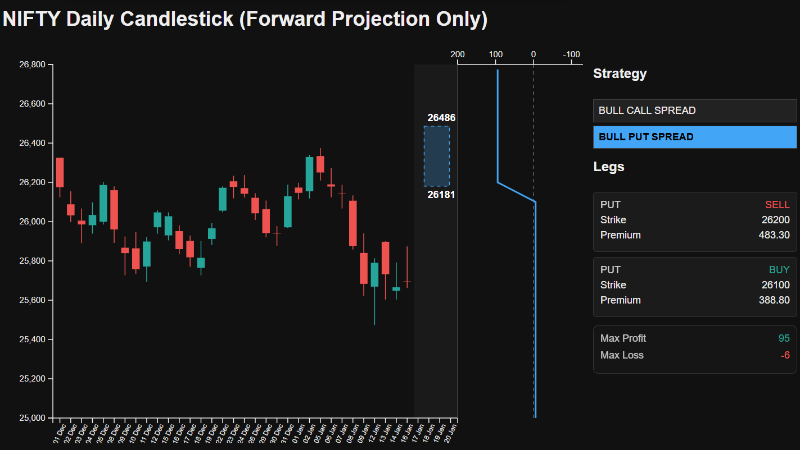

## Interactive: Options Strategy Explorer

This interactive tool is designed to help you **learn options strategies visually** — not by memorizing payoff diagrams, but by *experimenting with market expectations*.

Instead of asking *“Which strategy should I use?”*, the chart encourages you to think:

> **“Where do I believe NIFTY could trade next?”**

Based on that view, the tool helps you explore which strategies naturally fit that expectation.

---

## How the Interactive Chart Works

Use the chart below to project a **future price range** for NIFTY and explore how different **options strategies** behave within that range.

### What you can do:
- Drag a box in the shaded **future projection area**
- Suggested strategies update automatically
- Click any strategy to see:
  - Strategy legs (BUY / SELL, strikes, premiums)
  - Payoff curve
  - Max profit and max loss

  <iframe
    src="./assets/nifty-options-projection.html"
    width="100%"
    height="620"
    style="
      border:1px solid #333;
      border-radius:10px;
      background:#111;
    "
    loading="lazy"
    title="NIFTY Options Projection Tool">
  </iframe>

---

## What Does “Draw the Box” Mean?

When you **draw a box in the shaded region**, you are expressing your **market belief**:

- The **top of the box** represents where you think NIFTY might *max out*
- The **bottom of the box** represents where you think NIFTY might *find support*
- The **height of the box** reflects how volatile or stable you expect the market to be

The tool reads this range and suggests strategies that **naturally benefit** from that kind of market behavior.
> Below is an image representation to show how the box projection looks

  

> Think of the box as your **forecast**, not a trade.

---

## Learn by Trying Different Market Views

The real power of this tool comes from **experimentation**.

Try drawing:
- A **tight range** → notice how neutral strategies appear
- A **wide range** → observe how risk and payoff change
- A range **above spot** → bullish strategies emerge
- A range **below spot** → bearish strategies appear

Click each strategy and study:
- How many legs it has
- Where profit is capped
- Where losses are limited — or unlimited
- How payoff shape changes with structure

Over time, you’ll start to **intuitively understand** why certain strategies exist.

---

## Strategy Payoff & Risk Intuition

Each selected strategy displays:
- A **live payoff curve**
- Clear **max profit and max loss**
- Explicit indication when risk is **unlimited** (e.g. short straddles and strangles)

This helps build intuition around questions like:
- Why spreads limit risk
- Why neutral strategies collect premium
- Why some trades look attractive but carry hidden danger

---

## Important Disclaimer

This is a **learning and visualization tool only**.

- It does **not** account for execution costs, slippage, or real-time margin rules
- Option prices are **static snapshots**
- This is **not trading advice**

Use it to **learn, explore, and question** — not to place live trades blindly.

---

## Final Thought

Options make the most sense when you stop thinking in terms of *tips* and start thinking in terms of **ranges and probabilities**.

This tool is built to help you do exactly that — visually, interactively, and safely.

Draw boxes. Click strategies. Learn how options really work.
