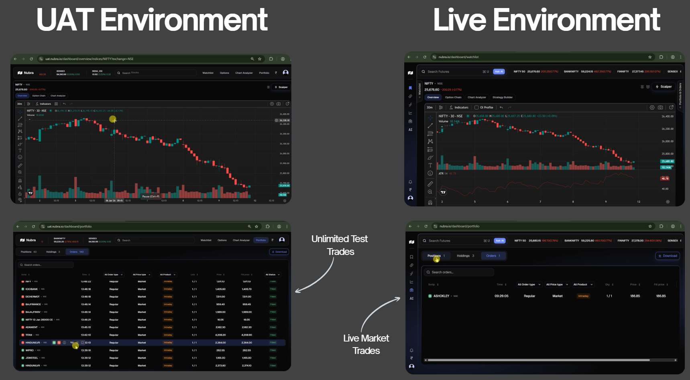

## What Is UAT?

UAT (User Acceptance Testing) is a safe place to test your trading strategies. It behaves like the real market, but everything is virtual—so you don’t risk real money.

Nubra’s UAT is built for:

- Testing your strategy in real market conditions  
- Using the same tools as live trading  
- Running large or fast strategies safely  
- Debugging, improving, and experimenting without stress

---

## UAT vs Live: What’s the Difference?

Nubra’s UAT environment **looks and works exactly like the live platform**, but it uses **simulated money and trades**.

| UAT Environment          | Live Environment         |
|--------------------------|--------------------------|
| Uses test capital         | Uses real capital         |
| Real-time prices          | Real-time prices          |
| Unlimited test trades     | Real trades with risk     |
| No real P&L               | Real profits or losses    |

  

> Both environments look the same — same charts, buttons, dashboards — so you can practice exactly how you’ll trade live.

---

## What You Can Do in UAT

### ✅ Trade on Real-Time Data  
Charts update live. Your strategy reacts to real price moves — just like in production.

### ✅ Use Unlimited Test Capital  
Place as many trades as you want. No need to fund your account.

### ✅ Use the Same Dashboards and APIs  
Test everything — strategy logic, order routing, API calls — with the same tools as live.

### ✅ No Financial Risk  
You can’t lose money in UAT. Mistakes won’t cost you.

### ✅ Test Margin and Portfolio Logic  
See how margin is calculated and how your portfolio behaves — all in a simulated way.

---

# Use UAT to test how your code performs under pressure — before going live.

---

## When to Use UAT

- 🧪 Trying a new trading idea  
- 🔁 Sending multi-leg orders or baskets  
- 🧠 Training or tuning a signal engine  
- 🛠️ Testing new code before release  
- 📉 Debugging rejections or margin issues  
- 📊 Running performance or speed tests  

---

## Final Takeaway

Nubra’s UAT is more than a demo — it’s a **live-like testing ground** for serious traders.

You get:

- Real-time market data  
- Full trading dashboards  
- No risk  
- Fast order testing  
- The same tools as live  

It’s the best way to test and improve your strategies — before you go live.

<!-- Replace 'uat-dashboard-hft-test.mp4' with your video filename placed in /assets/ -->
<video autoplay muted loop playsinline preload="auto" poster="./assets/nubra-cloudflare-status.svg">
	<source src="./assets/uat_vs_live.mp4" type="video/mp4">
	Your browser does not support the video tag. The Nubra status image will be shown instead.
</video>

