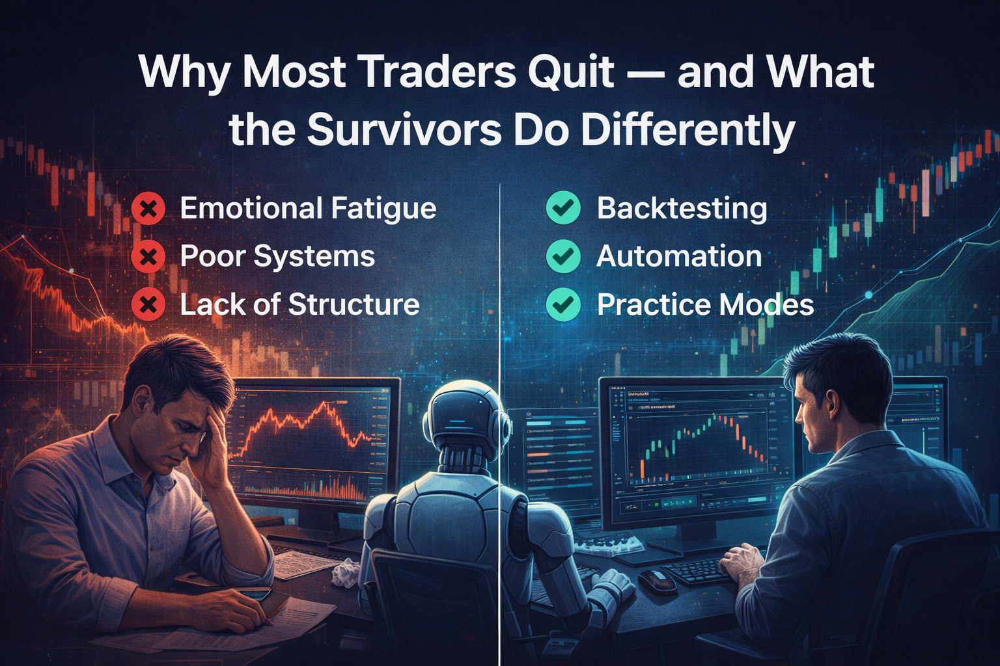

  

## Why Do So Many Traders Quit?

Trading seems simple at first:  
Buy low, sell high, repeat.

But in reality, most traders quit within their first 6–12 months.

Why?  
Not because the market is unbeatable — but because **their process is broken**.

---

## The Real Reasons Traders Burn Out

### 😤 Emotional Fatigue  
- Fear after a loss  
- Revenge after a miss  
- Anxiety when markets move fast  
- Dopamine spikes from wins that lead to overtrading

This emotional rollercoaster wears traders down quickly.

---

### ❌ No Defined System  
Many traders operate like this:

> “Let’s see how the chart looks today…”

They trade based on feeling, not rules. And when a few trades go wrong, there’s no structure to fall back on.

---

### 📉 Poor Risk Management  
- No fixed position sizing  
- No stop-loss discipline  
- Using full capital on one idea  
- Letting losses run “just in case it comes back”

Without clear limits, one bad day can erase weeks of effort — or more.

---

### 🌀 Lack of Review and Feedback  
If you don’t track what’s working (or failing), how can you improve?

Most traders don’t review their performance. They just move on to the next trade.

---

## What Successful Traders Do Differently

Survivors don’t trade harder — they trade **smarter**.  
Here’s what they build into their process:

---

## 1. 🧪 They Backtest Ideas Before Going Live  
Before risking capital, they test strategies:

- On historical data  
- In simulated environments  
- With clear entry/exit rules

This builds confidence in the idea and avoids blind spots.

---

## 2. 🛠️ They Use Tools to Add Structure

- **UAT environments** for testing under real market conditions  
- **Dashboards** that track open positions and risk  
- **APIs** to remove human error and emotional entry

Structure reduces decision fatigue — and improves consistency.

---

## 3. 📓 They Journal and Track Performance  
Winning traders know:

- What their win rate is  
- What time of day they perform best  
- Which setups work consistently

Even simple notes or screenshots after trades can reveal patterns over time.

---

## 4. 🧠 They Set Rules — and Follow Them  
A system isn’t just for entries. It includes:

- Position size caps  
- Daily loss limits  
- Strategy kill-switches  
- Time-blocked trading hours

This prevents impulsive behavior during high emotion.

---

## 5. ⏱️ They Use Practice Modes Before Going Live  
No one would fly a plane without a simulator.  
Trading should be the same.

Using tools like UAT (User Acceptance Testing), traders can:

- Run their exact strategy  
- With real-time market data  
- But using virtual capital  

This helps debug mistakes, optimize logic, and reduce surprises in live mode.

---

## Final Takeaway

Most traders don’t quit because the market is unfair.  
They quit because they’re unprepared for the **mental and structural demands** of trading.

The traders who survive build systems:
- Tools to reduce emotion  
- Environments to test safely  
- Rules they actually follow

Success in trading isn’t about predicting the future.  
It’s about being ready for it — over and over again.

Build your structure.  
Then stick around long enough to let it work.

