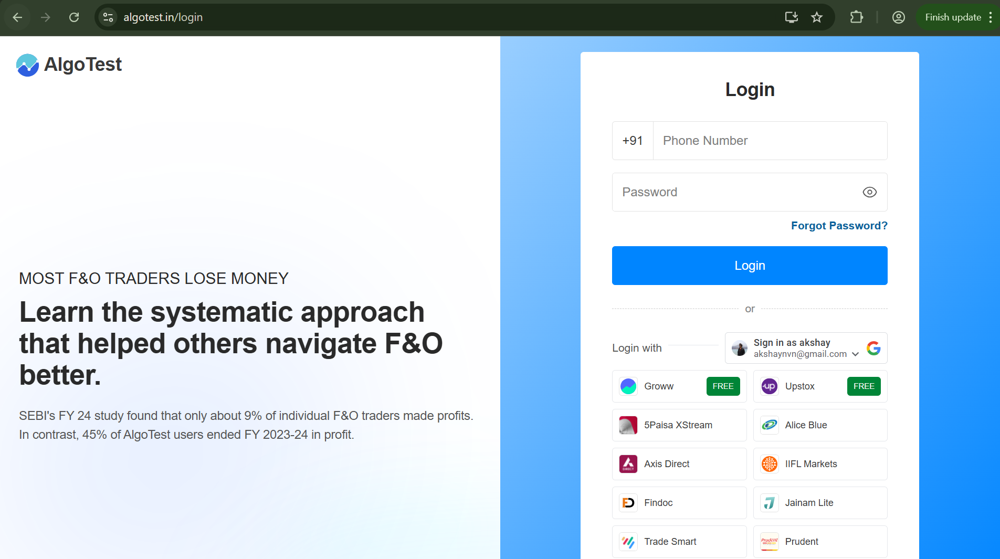
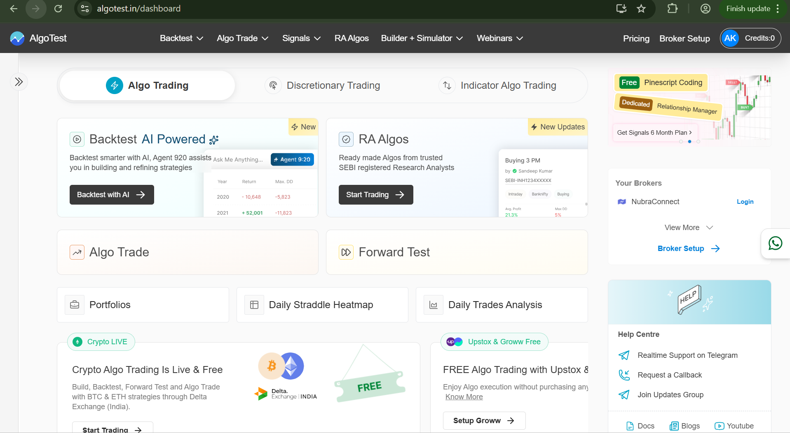
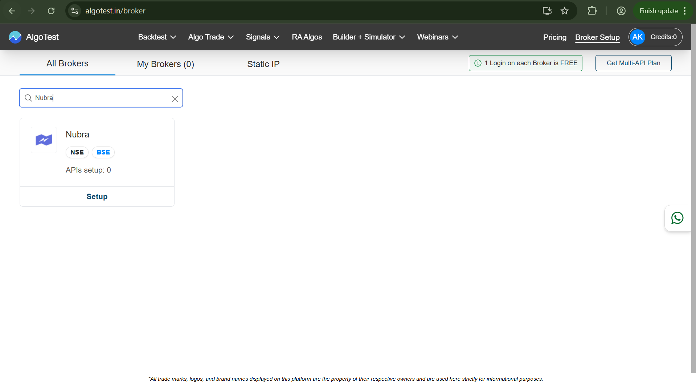
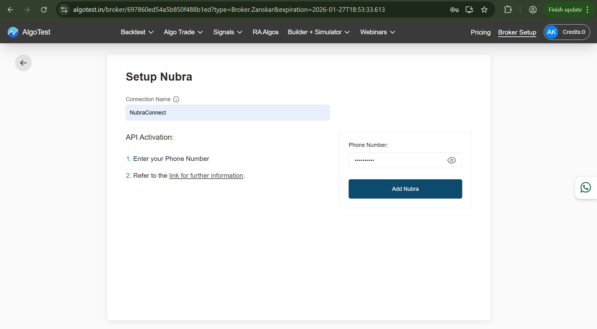
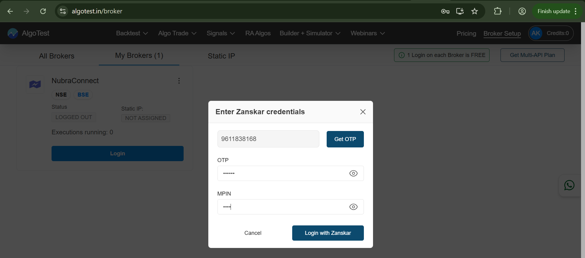
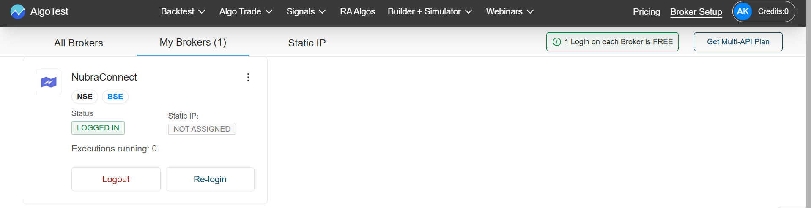

---

Nubra is designed to work seamlessly with **modern no-code and low-code algo trading platforms**.

This guide explains **how Nubra integrates with AlgoTest as a broker**, allowing traders to deploy strategies without writing infrastructure code, while still benefiting from **customized brokerage behavior** based on how they trade.

If Nubra shows **LOGGED IN** under *My Brokers* on AlgoTest, the integration is complete.

---

## Why Nubra Works Well with No-Code Algo Platforms

Algo platforms focus on strategy building and execution logic.  
Nubra focuses on **brokerage, authentication, and order routing**.

This separation allows:

- No-code / low-code algo platforms to stay simple
- Nubra to handle broker-grade authentication securely
- Traders to customize execution behavior without managing APIs directly

AlgoTest is one such platform where Nubra integrates natively.

---

## Prerequisites

Before starting the integration, ensure:

- You have an active **Nubra trading account**
- Your Nubra account has:
  - A registered phone number
  - OTP access
  - An active MPIN
- You have an AlgoTest account and are logged in on desktop

---

## Step 1: Login to AlgoTest

From Nubra’s perspective, AlgoTest acts as the **execution interface**.

Start by logging into AlgoTest using any supported method:

- Phone number + password  
- Google sign-in  
- Partner broker sign-in  

Once logged in, AlgoTest becomes the control layer through which Nubra executes orders.

---

## Step 2: Open Broker Setup on AlgoTest

Navigate to:

**Broker Setup**

This section lists all brokers that AlgoTest can connect with, including Nubra.

You will see:
- **All Brokers** – supported broker integrations
- **My Brokers** – brokers already connected to your account

---

## Step 3: Select Nubra as Your Broker

In **All Brokers**, search for **Nubra**.

Click **Setup** to begin the Nubra integration.

This tells AlgoTest that Nubra will be used as the execution broker.

---

## Step 4: Configure the Nubra Connection

You’ll now see the Nubra setup screen.

Provide:

- **Connection Name** – a label for your Nubra account
- **Registered Phone Number** – the phone number linked to your Nubra account

Click **Add Broker** to proceed.

At this stage:
- Nubra is registered inside AlgoTest
- No authentication has happened yet
- No OTP is triggered

This step only establishes the broker linkage.

---

## Step 5: Nubra Appears Under “My Brokers”

After setup, Nubra will appear under **My Brokers**.

You should see:

- Status: **Logged Out**
- Executions running: `0`

This indicates that AlgoTest is aware of Nubra, but Nubra has not yet authenticated the session.

---

## Step 6: Authenticate Nubra (OTP + MPIN)

Click **Setup** on the Nubra card.

This initiates Nubra’s authentication flow from within AlgoTest.

---

### Step 6.1: OTP Verification (Nubra)

- Click **Get OTP**
- Enter the OTP sent by Nubra to your registered phone number

This verifies device and user ownership.

---

### Step 6.2: MPIN Verification (Nubra)

After OTP verification, enter your Nubra MPIN.

Click **Login** to complete authentication.

At this point, Nubra issues an authenticated session to AlgoTest.

---

## Step 7: Confirm Successful Nubra Integration

Return to **My Brokers**.

Nubra should now display:

- **Status: LOGGED IN**
- Executions running: `0`

This confirms that Nubra is fully integrated and authenticated with AlgoTest.

From Nubra’s side, this means:
- Orders from AlgoTest are now authorized
- No further login is required until session expiry

---

## How Nubra’s Custom Brokerage Helps Traders

Because Nubra handles brokerage separately from the algo platform:

- Traders can use **no-code tools** without losing control
- Execution behavior can be customized at the broker level
- Authentication, sessions, and permissions remain secure

This allows traders to choose *how much abstraction they want*:
- Fully no-code
- Low-code
- Or custom workflows layered on top

---

## Troubleshooting Tips

If Nubra login fails:

- Ensure the phone number matches Nubra records
- Enter OTP within the valid time window
- Verify MPIN accuracy
- Reattempt login if the session expires

---

## Integration Complete

Once Nubra shows **LOGGED IN** under *My Brokers*, the integration is complete.

Nubra is now ready to act as the execution broker for AlgoTest and other supported no-code or low-code algo trading platforms.

