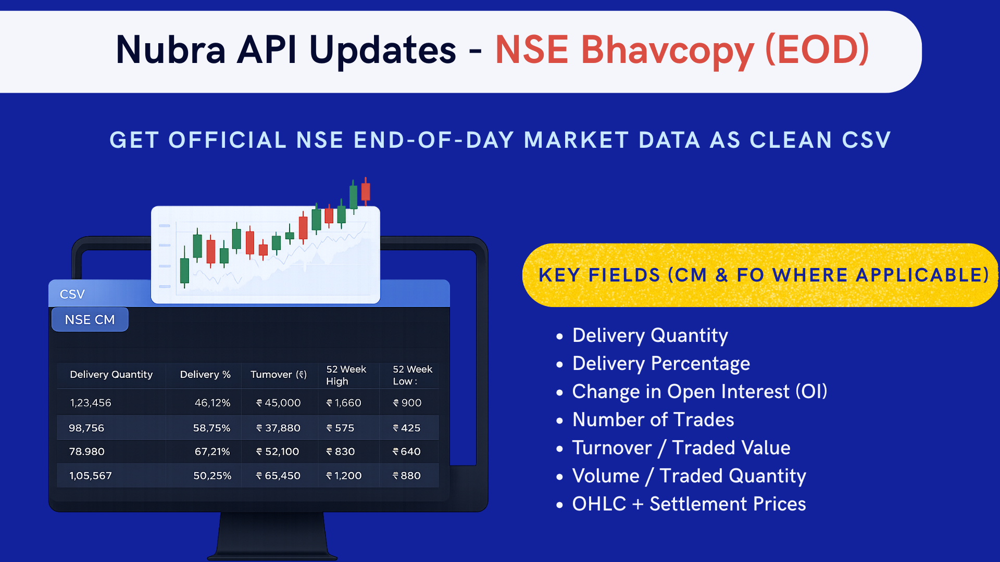
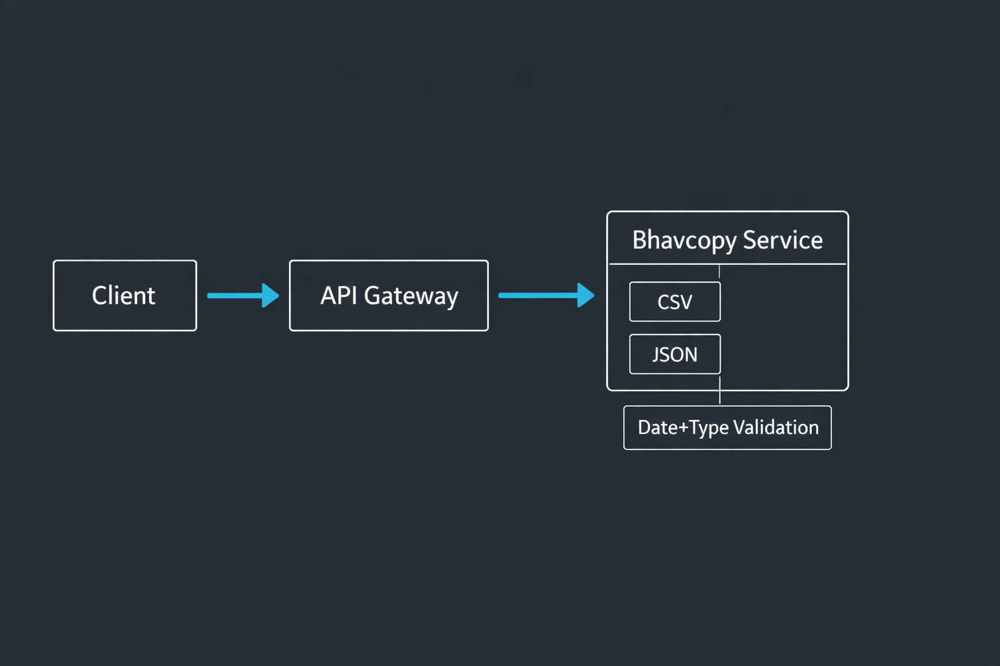

Bhavcopy data is the closest thing Indian markets have to a daily, exchange-certified truth table.  
It is not glamorous. It is not real time. It is often more useful than both.

This piece is about using bhavcopy data the way brokers and serious traders should: as a reliable end-of-day substrate for inference, not as a magical signal generator.

## What a Bhavcopy Is (and Why Exchanges Publish It)

A **bhavcopy** is the exchanges official end-of-day summary of trading activity for a given segment (cash market, FO, etc.).

Exchanges publish it because markets need:

- A canonical reference for settlement-era prices
- A daily audit layer for market-wide activity
- A consistent substrate for analysis, compliance, and backtesting

If you build market analytics without bhavcopy alignment, you eventually discover you were analyzing a different market than the one the exchange settled.

## What You Actually Get Inside a Bhavcopy

The exact fields vary by segment, but practically useful bhavcopy datasets tend to include:

- Price fields: open, high, low, close, previous close
- Activity fields: traded quantity, traded value, number of trades
- Participation hints: delivery quantity, delivery percentage (cash market)
- Derivatives context (where applicable): open interest, change in OI

Two broker-facing reminders matter here:

- Prices are often scaled (paise vs rupees). Normalize explicitly.
- Symbols drift. Ref IDs and instrument masters still matter, even for EOD data.

## Four EOD Use Cases That Actually Hold Up

Bhavcopy is frequently pitched as a retail scanner. That undersells it. The highest-value use cases are structural.

### 1) EOD Trend Confirmation Without Intraday Noise

Intraday charts lie by construction: they are snapshots of a moving microstructure.  
Bhavcopy closes are what survive the days noise.

A practical EOD trend pass usually asks:

- Did close break structure on exchange-certified data?
- Was the move accompanied by participation (volume/value)?
- Did delivery confirm or contradict the move?

### 2) Delivery % as a Crude but Useful Participation Signal

Delivery percentage is not smart money detection. It is a coarse participation signal.

It becomes useful when you stop treating it as a trigger and start treating it as context:

- Rising delivery + rising price: sticky participation is plausible
- Falling delivery + rising price: move may be more rotational than committed

### 3) Institutional Activity Inference (Carefully, Not Lazily)

Bhavcopy does not label institutions. It lets you ask sharper questions:

- Was the move broad or concentrated?
- Did participation look transient or sticky?
- Was there confirmation across related instruments?

If you are a broker, the product win is to expose these as **lenses**, not claims.

### 4) Backtesting Inputs That Dont Quietly Shift Under You

If your backtests are trained on vendor-adjusted OHLC but validated on exchange bhavcopy, you�re already dealing with dataset mismatch risk.

Bhavcopy is especially good for:

- Cross-sectional daily ranking models
- Delivery-aware filters
- FO participation screens based on OI change

## How Brokers Should Expose Bhavcopy via APIs

Most brokers treat bhavcopy as a file download problem. Thats too primitive for modern workflows.

A broker-grade bhavcopy surface typically offers:

- Date-scoped endpoints (with explicit segment selection)
- Clear field dictionaries per segment
- Stable instrument identifiers alongside symbols
- Consistent scaling rules (and documentation for them)

Conceptually, the flow should look like this:

If your bhavcopy API requires traders to reverse-engineer field meanings, you have not shipped an API. You have shipped a puzzle.

## Limitations You Should State Explicitly

Bhavcopy is powerful partly because it is slow and authoritative. That comes with constraints:

- It is end-of-day. It will not rescue intraday risk.
- It is summary data. It cannot explain intraday path dependency.
- It is segment-specific. Cross-segment alignment still needs care.

A final broker note: bhavcopy should be the **truth anchor** for EOD, not the only dataset. The win is in using it to validate and stabilize everything else.

