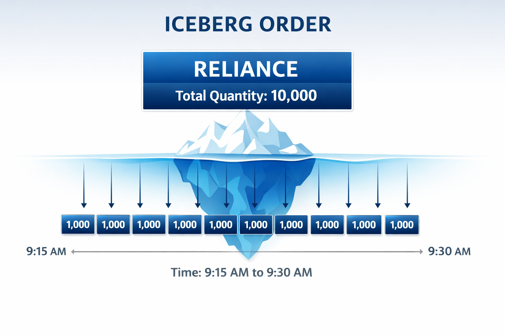

Iceberg orders are often explained as hiding size. That framing is both incomplete and dangerous.  
Icebergs do not make you invisible. They make you *less legible*.

## What an Iceberg Order Actually Is

An Iceberg order splits a large parent order into smaller visible slices (legs).  
Only the current slice is displayed; the rest stays hidden until needed.

That's the mechanism. The purpose is to reduce signalling and manage impact.

## Why Exchanges Support Iceberg Orders

Exchanges are not doing you a favour. They are supporting market quality.

Icebergs help exchanges:

- Encourage large participation without destabilising the book
- Reduce the incentive to spray large visible orders
- Improve the chance that size can be executed in an orderly way

It is a market design tool, not a retail hack.

## Who Benefits Most (and Why)

Icebergs are most useful when visibility is costly.

- **Institutions**: need to move size without broadcasting intent
- **Large directional traders**: want fills without immediate adverse reaction
- **Liquidity-sensitive participants**: care more about impact than speed

Small traders can use icebergs too, but the edge is less about hiding and more about execution hygiene.

## Icebergs and Price Discovery: A Necessary Tension

Icebergs reduce visible information in the book. That can:

- Smooth some impact
- Also make the book look thinner than it truly is

This is not inherently good or bad. It is a trade-off between signalling and transparency.

## Iceberg vs TWAP vs VWAP: Choose Based on Failure Modes

A practical way to choose order types is to choose your preferred failure.

- Iceberg: risk of incomplete execution; lower signalling
- TWAP: risk of being gamed over time; predictable schedule
- VWAP: risk of volume model mismatch; volume-aware schedule

If you cannot tolerate incomplete fills, icebergs are not your primary tool.

## Misconceptions That Cause Bad Trades

Three bad assumptions show up repeatedly:

- Icebergs guarantee better prices. They do not.
- Hidden size means no impact. It still has impact.
- I can ignore leg size tuning. Leg size is the strategy.

A broker-grade iceberg API should force leg size clarity rather than guess it.
