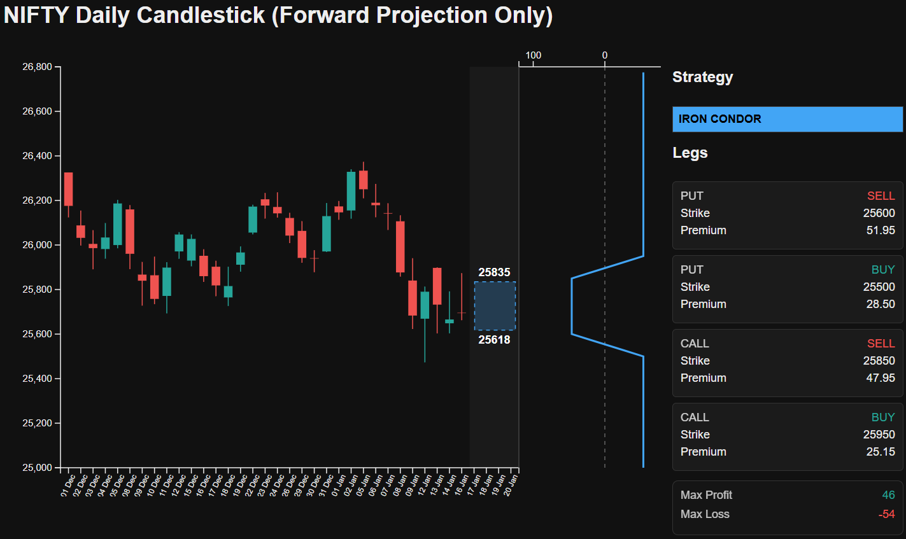
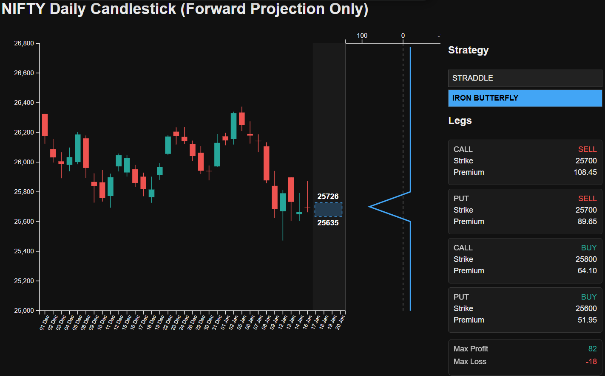

Range strategies are sold as high probability. 
They are actually high regret if you don't understand where the risk lives.

This guide is about placing Iron Condors and Iron Butterflies with clarity about regime, structure, and failure modes.

## Iron Condor Payoff and Range


## Start With Regime: What Each Strategy Is Trying to Harvest

Both strategies are short-volatility, but they express it differently.

- **Iron Condor**: wider tent, smaller premium, more forgiving if you're roughly right
- **Iron Butterfly**: narrow tent, larger premium near ATM, more sensitive to spot drift

If your volatility view is quiet but not dead, condors tend to age better.

## Structure Without Hand-Waving

### Iron Condor (short inner, long outer)

- Sell OTM put
- Buy further OTM put
- Sell OTM call
- Buy further OTM call

### Iron Butterfly (short ATM straddle, long wings)

- Sell ATM put and call
- Buy OTM put and call as protection

The butterfly concentrates risk at the centre. The condor distributes it.
## Iron Butterfly Payoff and Range



## Payoff Facts You Should Compute, Not Memorize

The standard facts still matter:

- Max profit is the net credit received
- Max loss is the wing width minus the credit
- Breakevens sit at short strikes plus/minus credit

But you should compute payoffs explicitly, especially for broken wings or uneven lots.

## A Compact Payoff Calculator (Condor + Butterfly)

The following snippet is intentionally short and explicit.

```python
def payoff_short_option(spot, strike, premium, is_call):
    intrinsic = max(0, spot - strike) if is_call else max(0, strike - spot)
    return premium - intrinsic

def payoff_long_option(spot, strike, premium, is_call):
    intrinsic = max(0, spot - strike) if is_call else max(0, strike - spot)
    return intrinsic - premium

def iron_condor_payoff(spot, p_long, p_short, c_short, c_long, prem):
    pl = payoff_long_option(spot, p_long, prem[0], False)
    ps = payoff_short_option(spot, p_short, prem[1], False)
    cs = payoff_short_option(spot, c_short, prem[2], True)
    cl = payoff_long_option(spot, c_long, prem[3], True)
    return pl + ps + cs + cl
```

Keep premiums aligned with legs. Most payoff mistakes are indexing mistakes.

## When One Beats the Other

A practical decision rule:

- Prefer **condors** when you want tolerance for modest drift
- Prefer **butterflies** when you want maximum credit near a strong pinning view

If you don't have a pinning view, you don�t have a butterfly view.

## The Risk That Actually Bites

The risk is not just spot moves. The risk is **spot moves while IV and skew shift against you**.

That's why brokers and serious traders track both premium and Greeks rather than just final payoff diagrams.
