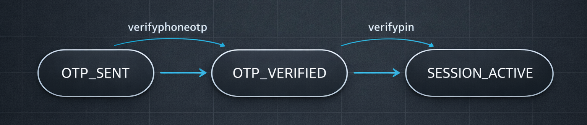

We designed our auth flow as a staged process. If you treat it like a single login call, you'll end up with brittle automation.

We'll focus on what helps you run safely in production: clear token roles, strict header hygiene, and consistent `x-device-id` usage.


## The Token Ladder (Temp ? Auth ? Session)

You will see three different tokens in our auth flow:

- `temp_token`: returned by `sendphoneotp`
- `auth_token`: returned by `verifyphoneotp`
- `session_token`: returned by `verifypin`

Use this mental model:

- `temp_token` means `OTP has been initiated`
- `auth_token` means `OTP has been verified`
- `session_token` means `the session is authenticated`

Most protected endpoints should be called with a valid **Bearer `session_token`**.

## Step-by-Step: OTP ? MPIN (The Core Flow)

### 1) Initiate OTP

```bash
curl --location 'https://api.nubra.io/sendphoneotp' \
--header 'Content-Type: application/json' \
--data '{
  "phone": "0000000000",
  "skip_totp": false
}'
```

The response includes a `temp_token` and a next step of `VERIFY_MOBILE`.

### 2) Verify OTP with `x-temp-token` and `x-device-id`

OTP verification is also where we bind the device context.

```bash
curl --location 'https://api.nubra.io/verifyphoneotp' \
--header 'x-temp-token: eyJh...zd0' \
--header 'x-device-id: TS123' \
--header 'Content-Type: application/json' \
--data '{
  "phone": "0000000000",
  "otp": "341874"
}'
```

The response includes an `auth_token` and a next step of `ENTER_MPIN`.

### 3) Verify MPIN using `Authorization: Bearer <auth_token>`

This is the step that produces the session token you'll use everywhere else.

```bash
curl --location 'https://api.nubra.io/verifypin' \
--header 'x-device-id: TS123' \
--header 'Content-Type: application/json' \
--header 'Authorization: Bearer 7a1171e6-...' \
--data '{
  "pin": "1234"
}'
```

The response includes a `session_token` and a next step of `DASHBOARD`.

## Optional TOTP Flow (Layered on Top of a Session)

We support TOTP as a secondary method you can enable after you already have a valid session token.

A reliable way to think about it:

- Session first
- TOTP configuration second
- TOTP login becomes an alternative entry path

### Generate the secret

```bash
curl --location 'https://api.nubra.io/totp/generate-secret' \
--header 'Authorization: Bearer {{session_token}}' \
--header 'x-device-id: {{device_id}}'
```

The response includes a `secret_key` and a `qr_image`.

### Enable TOTP

```bash
curl --location 'https://api.nubra.io/totp/enable/{{totp}}' \
--header 'Authorization: Bearer {{session_token}}' \
--header 'x-device-id: {{device_id}}'
```

### Login via TOTP

```bash
curl --location 'https://api.nubra.io/totp/login' \
--header 'x-device-id: {{device_id}}' \
--header 'Content-Type: application/json' \
--data '{
  "email": "xyz@gmail.com",
  "totp": 307215
}'
```

TOTP login returns an `auth_token`, which still needs `verifypin` to produce a `session_token`.

## Header Hygiene Rules That Prevent Most Incidents

These patterns reduce most auth failures we see in the field:

- Keep `x-device-id` stable across the entire auth flow
- Use `x-temp-token` only on `verifyphoneotp`
- Use `Authorization: Bearer <auth_token>` for `verifypin`
- Use `Authorization: Bearer <session_token>` for protected APIs afterward
- Do not mix `x-temp-token` into post-auth flows

## Production-Friendly Auth State Machine

A simple, explicit state model makes it harder to misuse tokens:



If you model the states (`OTP_SENT`, `OTP_VERIFIED`, `SESSION_ACTIVE`), the headers fall into place.

## Environment Awareness (UAT vs PROD)

We run separate base URLs:

- UAT: `https://uatapi.nubra.io`
- Production: `https://api.nubra.io`

Keep the base URL and device ID explicit in configuration rather than buried in helper code.


