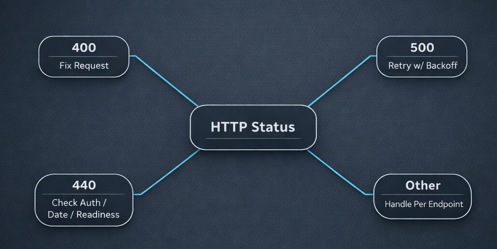

Most trading outages aren't caused by missing features. They're caused by predictable failures handled poorly.

We keep our error shapes and rate limits simple on purpose. If you align your client behavior with that contract, you'll avoid most avoidable incidents.



## The Error Contract Is Simple (Use It)

Our APIs return errors in a consistent schema:

```json
{
  "error": "Description of the issue",
  "nubra_error_code": ""
}
```

Two details matter:

- `error` is the human-readable explanation
- `nubra_error_code` is reserved and may be empty

Build your client so it does not depend on `nubra_error_code` being populated.

## 400 vs 500: Handle Them Differently

We separate client errors from server errors.

### 400 � Bad Request

400 responses mean the request is invalid or violates business rules. Common causes include:

- Missing required fields
- Invalid parameters or enums
- Invalid `ref_id`
- Quantity or price limit breaches
- STOPLOSS orders without trigger price
- Invalid basket/flexi structures
- Malformed JSON

Example:

```json
{
  "error": "You cannot place this trade as it exceeds the maximum order quantity limit of 100000000",
  "nubra_error_code": ""
}
```

On 400, the right move is usually to fix the request, not retry it.

### 500 � Internal Server Error

500 responses indicate an unexpected backend or OMS failure. In these cases, retrying after a short delay with bounded exponential backoff for automation is appropriate.

## 440 in EOD Report Flows

On our bhavcopy/report endpoints, you may see HTTP 440 in cases like:

- Bhavcopy not generated yet
- Future or invalid date
- Invalid or expired session

Bhavcopy endpoint:

```text
GET /bhavcopy/nse/{date}?format=csv&type={type}
```

Keep `{date}` and the date embedded in `type` aligned.

## Rate Limits Are Part of Reliability

Our limits are part of the system�s safety envelope:

- Trading APIs (PROD): 10 ops/sec (per IP address)
- Trading APIs (UAT): 100 ops/sec
- Historical Data (REST): 60 requests/min
- WebSocket: weight-based subscription limits

These constraints should shape how you schedule, batch, and retry.

## A Practical Retry Posture That Works Well

Use different behaviors per class of failure:

- On 400: stop and correct the request
- On 500: retry with bounded exponential backoff
- On 440 (bhavcopy/EOD): re-check auth, date correctness, and readiness timing
- Under rate limits: slow down before retrying

Minimal pseudocode policy:

```text
if status == 400: stop and log validation error
elif status == 500: retry with exponential backoff
elif status == 440: re-check auth/date/readiness, then retry later
else: handle per endpoint contract
```

## Defensive Patterns That Reduce Noise

- Validate STOPLOSS and ICEBERG requirements before submission
- Keep date and `type` aligned on bhavcopy requests
- Treat OPS limits as a hard envelope for trading loops
- Budget WebSocket subscriptions using weights

This isn�t about clever retry logic. It�s about staying inside the contract so your systems behave predictably.


