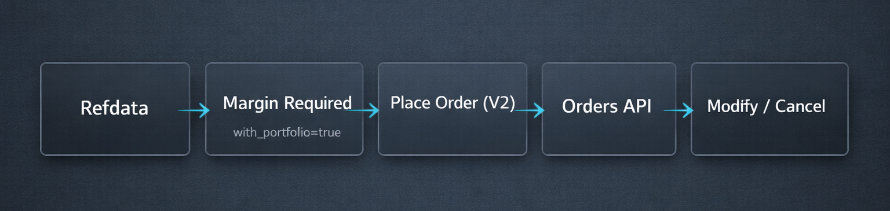
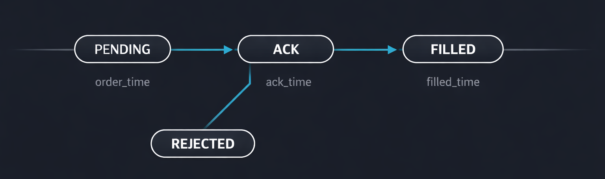

Place order is not an order lifecycle. It is one step in a risk-sensitive pipeline.

Here's how we recommend you integrate our Trading V2 surface so you get safety, clarity, and fewer production surprises.



## Step 0: Resolve the Instrument via Refdata

Our trading calls use `ref_id`. Resolve it for the trading date and exchange before you place anything.

```text
GET /refdata/refdata/{date}?exchange=NSE
```

```bash
curl --location 'https://api.nubra.io/refdata/refdata/2025-06-27?exchange=NSE' \
--header 'x-device-id: TS1234' \
--header 'Authorization: Bearer eyJhbGciOi...'
```

The response includes `refdata[]` entries with fields like `ref_id`, `lot_size`, `tick_size`, `asset_type`, and `expiry`.

### Why this matters

- Refdata is date-scoped
- Lot sizes and expiries affect both margin and order validity
- `ref_id` is the canonical trading identifier in our system

## Step 1: Run Margin Estimation Before Placing Orders

We use the same margin endpoint for both single orders and basket-style margin logic:

```text
POST /orders/v2/margin_required
```

The most important rule here is simple:

> Set `with_portfolio` to `true` when you want accurate margin.

### Single-order margin pattern

```json
{
  "with_portfolio": true,
  "with_legs": false,
  "is_basket": false,
  "order_req": {
    "exchange": "NSE",
    "orders": [
      {
        "ref_id": 1755599,
        "order_type": "ORDER_TYPE_REGULAR",
        "price_type": "MARKET",
        "order_qty": 75,
        "order_price": 0,
        "order_side": "ORDER_SIDE_BUY",
        "order_delivery_type": "ORDER_DELIVERY_TYPE_CNC",
        "validity_type": "IOC",
        "request_type": "ORDER_REQUEST_NEW"
      }
    ]
  }
}
```

### What to read in the response

Use `total_margin` as the authoritative value for order placement. Treat component fields like `span` and `exposure` as diagnostic context.

## Step 2: Place a Single Order (Trading V2)

```text
POST /orders/v2/single
```

```json
{
  "ref_id": 250486,
  "order_type": "ORDER_TYPE_STOPLOSS",
  "order_qty": 4,
  "order_side": "ORDER_SIDE_BUY",
  "order_delivery_type": "ORDER_DELIVERY_TYPE_CNC",
  "validity_type": "DAY",
  "price_type": "LIMIT",
  "order_price": 283,
  "tag": "order_test",
  "algo_params": {
    "trigger_price": 113
  }
}
```

### Order-type rules that prevent avoidable rejects

- STOPLOSS requires `algo_params.trigger_price`
- ICEBERG requires `algo_params.leg_size`
- Prices are in paise

## Step 3: Observe Order State (Do Not Guess)

We expose both broad order inspection and order-by-ID lookups. Use both.

### Get orders for the day

```text
GET /orders/v2?live=1
GET /orders/v2?executed=1
GET /orders/v2?tag=test_order
```

### Get a specific order by ID

```text
GET /orders/{order_id}
```

You'll see `order_status`, timestamps like `order_time`, `ack_time`, `filled_time`, and the `exchange_order_id` when available.



## Step 4: Modify or Cancel with the Right Constraints

### Modify order

```text
POST /orders/v2/modify/{order_id}
```

When you modify, keep the order type requirements intact:

- STOPLOSS modifications require `trigger_price` in `algo_params`
- ICEBERG modifications require `leg_size` in `algo_params`

```json
{
  "order_qty": 100,
  "order_price": 11800,
  "exchange": "NSE",
  "order_type": "ORDER_TYPE_STOPLOSS",
  "algo_params": {
    "trigger_price": 11380
  }
}
```

### Cancel order(s)

We support both single cancels and batch cancels:

- `DELETE /orders/{order_id}`
- `POST /orders/cancel`

```json
{
  "orders": [
    { "order_id": 1234 }
  ]
}
```

## OPS Guidance Is Part of Correctness

Our trading rate guidance is not just about performance. It helps you stay inside a stable execution envelope:

- Trading APIs (PROD): 10 ops/sec per IP address
- Trading APIs (UAT): 100 ops/sec

## A Minimal, Safe Order Lifecycle Checklist

- Resolve `ref_id` before trading
- Estimate margin with `with_portfolio: true`
- Place using the required fields for the chosen order type
- Poll/inspect via the orders endpoints
- Modify/cancel without breaking order-type constraints
- Stay inside the OPS envelope


