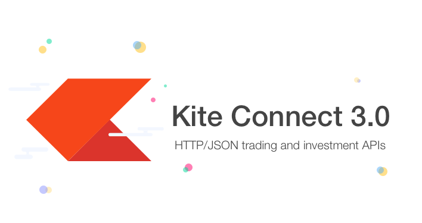
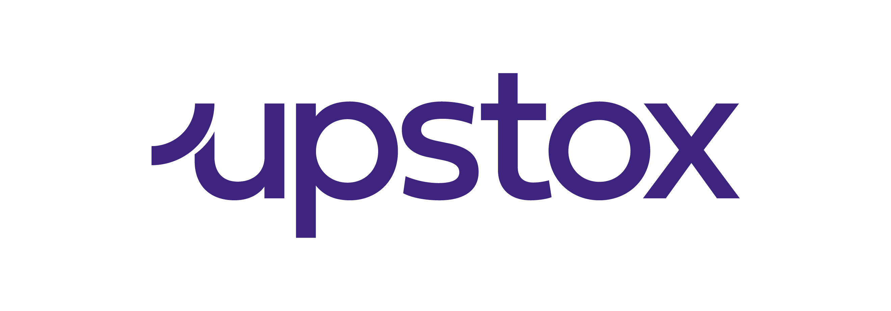

Switching brokers does not have to mean rewriting your entire trading stack. This guide shows quick, direct code switches between Zerodha (Kite Connect) and Nubra for the most common workflows.

What changes most:
- Instrument identifiers (Zerodha uses instrument_token, Nubra uses ref_id or symbols)
- Method names and parameter keys
- Realtime streaming classes and subscription formats

Below are three common requests and the smallest code you need to switch.

## 1) Market Order

<div style="display: flex; gap: 32px; align-items: flex-start; flex-wrap: wrap;">

  <!-- Nubra Column -->
  <div style="flex: 1; min-width: 320px;">

  <div class="logo-button" role="presentation">
    
    <span>Nubra</span>
  </div>

  ```python
from nubra_python_sdk.start_sdk import InitNubraSdk, NubraEnv
from nubra_python_sdk.trading.trading_data import NubraTrader
from nubra_python_sdk.refdata.instruments import InstrumentData

nubra = InitNubraSdk(NubraEnv.PROD)
trade = NubraTrader(nubra, version="V2")
instruments = InstrumentData(nubra)

ref_id = instruments.get_instrument_by_symbol("HDFCBANK", exchange="NSE").ref_id

result = trade.create_order({
    "ref_id": ref_id,
    "order_side": "ORDER_SIDE_BUY",
    "order_type": "ORDER_TYPE_REGULAR",
    "price_type": "MARKET",
    "order_qty": 1,
    "validity_type": "IOC",
    "order_delivery_type": "ORDER_DELIVERY_TYPE_CNC",
    "exchange": "NSE",
    "tag": "Market_example"
})

print(result.order_id)
  ```

  </div>

  <!-- Zerodha Column -->
  <div style="flex: 1; min-width: 320px;">

<div class="broker-toggle" data-broker-group="market-order">
  <div class="broker-logos">
    <div class="logo-button is-active" role="button" tabindex="0" data-broker-target="zerodha">
      
      <span>Zerodha</span>
    </div>
    <div class="logo-button" role="button" tabindex="0" data-broker-target="dhan">
      
      <span>Dhan</span>
    </div>
    <div class="logo-button" role="button" tabindex="0" data-broker-target="upstox">
      
      <span>Upstox</span>
    </div>
  </div>

  <div class="broker-code" data-broker-output></div>

  <textarea class="broker-code-source" data-broker-code="zerodha">from kiteconnect import KiteConnect

kite = KiteConnect(api_key=API_KEY)
kite.set_access_token(ACCESS_TOKEN)

order_id = kite.place_order(
    variety=kite.VARIETY_REGULAR,
    exchange=kite.EXCHANGE_NSE,
    tradingsymbol="HDFCBANK",
    transaction_type=kite.TRANSACTION_TYPE_BUY,
    quantity=1,
    product=kite.PRODUCT_CNC,
    order_type=kite.ORDER_TYPE_MARKET,
    validity=kite.VALIDITY_IOC
)

print(order_id)</textarea>

  <textarea class="broker-code-source" data-broker-code="dhan">import pandas as pd
from dhanhq import DhanContext, dhanhq

master = pd.read_csv("https://images.dhan.co/api-data/api-scrip-master.csv")
hdfc = master[
    (master["SEM_SEGMENT"] == "E") &
    (master["SM_SYMBOL_NAME"] == "HDFCBANK")
].iloc[0]
security_id = str(hdfc["SEM_EXM_EXCH_ID"])

dhan_context = DhanContext("client_id", "access_token")
dhan = dhanhq(dhan_context)

order_id = dhan.place_order(
    security_id=security_id,
    exchange_segment=dhan.NSE,
    transaction_type=dhan.BUY,
    quantity=1,
    order_type=dhan.MARKET,
    product_type=dhan.INTRA,
    price=0
)

print(order_id)</textarea>
  <textarea class="broker-code-source" data-broker-code="upstox"># Upstox code coming soon.</textarea>
</div>

  </div>

</div>

Tip: Zerodha uses a tradingsymbol plus exchange. Nubra uses ref_id for the instrument.

---

## 2) Historical Data (Candles)

<div style="display: flex; gap: 32px; align-items: flex-start; flex-wrap: wrap;">

  <!-- Nubra Column -->
  <div style="flex: 1; min-width: 320px;">

  <div class="logo-button" role="presentation">
    
    <span>Nubra</span>
  </div>

  ```python
from nubra_python_sdk.market_data.market_data import MarketData

md = MarketData(nubra)
result = md.historical_data({
    "exchange": "NSE",
    "type": "STOCK",
    "values": ["RELIANCE"],
    "fields": ["open", "high", "low", "close", "cumulative_volume"],
    "startDate": "2025-01-01T03:45:00.000Z",
    "endDate": "2025-01-31T10:00:00.000Z",
    "interval": "1d",
    "intraDay": False,
    "realTime": False
})
print(result)
  ```

  </div>

  <!-- Zerodha Column -->
  <div style="flex: 1; min-width: 320px;">
<div class="broker-toggle" data-broker-group="historical-data">
  <div class="broker-logos">
    <div class="logo-button is-active" role="button" tabindex="0" data-broker-target="zerodha">
      
      <span>Zerodha</span>
    </div>
    <div class="logo-button" role="button" tabindex="0" data-broker-target="dhan">
      
      <span>Dhan</span>
    </div>
    <div class="logo-button" role="button" tabindex="0" data-broker-target="upstox">
      
      <span>Upstox</span>
    </div>
  </div>

  <div class="broker-code" data-broker-output></div>

  <textarea class="broker-code-source" data-broker-code="zerodha"># To be updated.</textarea>
  <textarea class="broker-code-source" data-broker-code="dhan"># To be updated.</textarea>
  <textarea class="broker-code-source" data-broker-code="upstox"># To be updated.</textarea>
</div>

  </div>

</div>

Tip: Zerodha needs instrument_token and date strings. Nubra uses a dict with exchange, type, values, and ISO timestamps.

---

## 3) Realtime Data (Streaming)

<div style="display: flex; gap: 32px; align-items: flex-start; flex-wrap: wrap;">

  <!-- Nubra Column -->
  <div style="flex: 1; min-width: 320px;">

  <div class="logo-button" role="presentation">
    
    <span>Nubra</span>
  </div>

  ```python
from nubra_python_sdk.market_data.data_socket import NubraDataSocket, SocketDataType

def on_message(msg):
    print(msg)

socket = NubraDataSocket(
    access_token=ACCESS_TOKEN,
    subscriber_id=SUBSCRIBER_ID,
    on_message=on_message
)

socket.connect()
socket.subscribe({
    "data_type": SocketDataType.EQ_PRICE,
    "data": [
        {"exchange": "NSE", "type": "STOCK", "value": "RELIANCE"}
    ]
})
  ```

  </div>

  <!-- Zerodha Column -->
  <div style="flex: 1; min-width: 320px;">
<div class="broker-toggle" data-broker-group="realtime-data">
  <div class="broker-logos">
    <div class="logo-button is-active" role="button" tabindex="0" data-broker-target="zerodha">
      
      <span>Zerodha</span>
    </div>
    <div class="logo-button" role="button" tabindex="0" data-broker-target="dhan">
      
      <span>Dhan</span>
    </div>
    <div class="logo-button" role="button" tabindex="0" data-broker-target="upstox">
      
      <span>Upstox</span>
    </div>
  </div>

  <div class="broker-code" data-broker-output></div>

  <textarea class="broker-code-source" data-broker-code="zerodha"># To be updated.</textarea>
  <textarea class="broker-code-source" data-broker-code="dhan"># To be updated.</textarea>
  <textarea class="broker-code-source" data-broker-code="upstox"># To be updated.</textarea>
</div>

  </div>

</div>

Tip: Zerodha streams by instrument_token. Nubra streams by exchange, type, and symbol.

---

## Quick Mapping (Zerodha -> Nubra)

- Instrument ID: instrument_token -> ref_id or symbol
- Market order price: not required -> not required
- Realtime subscription: tokens list -> data_type plus data array

If you want, tell me which endpoints you use most (order status, positions, holdings, margins, etc.) and I will add more switch blocks.

---

## 4) Get Instruments

<div style="display: flex; gap: 32px; align-items: flex-start; flex-wrap: wrap;">

  <!-- Nubra Column -->
  <div style="flex: 1; min-width: 320px;">

  <div class="logo-button" role="presentation">
    
    <span>Nubra</span>
  </div>

  ```python
# To be updated.
  ```

  </div>

  <!-- Brokers Column -->
  <div style="flex: 1; min-width: 320px;">

<div class="broker-toggle" data-broker-group="get-instruments">
  <div class="broker-logos">
    <div class="logo-button is-active" role="button" tabindex="0" data-broker-target="zerodha">
      
      <span>Zerodha</span>
    </div>
    <div class="logo-button" role="button" tabindex="0" data-broker-target="dhan">
      
      <span>Dhan</span>
    </div>
    <div class="logo-button" role="button" tabindex="0" data-broker-target="upstox">
      
      <span>Upstox</span>
    </div>
  </div>

  <div class="broker-code" data-broker-output></div>

  <textarea class="broker-code-source" data-broker-code="zerodha"># To be updated.</textarea>
  <textarea class="broker-code-source" data-broker-code="dhan"># To be updated.</textarea>
  <textarea class="broker-code-source" data-broker-code="upstox"># To be updated.</textarea>
</div>

  </div>

</div>
