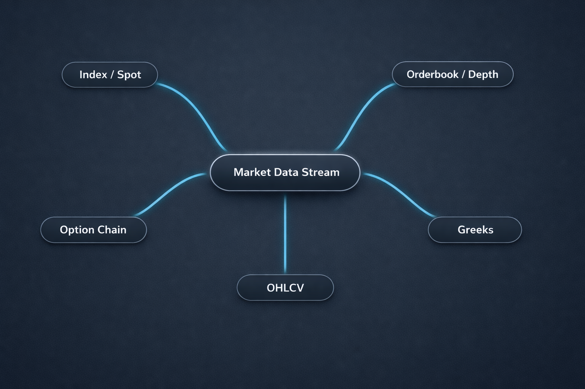

Our realtime surface is powerful, and the integration mistakes are predictable: subscribing to everything, mixing symbol and `ref_id` streams, and ignoring weight budgets.

Here's how we recommend you wire it up so it stays stable under load.

## One Connection, Multiple Streams

We provide a single WebSocket client (`NubraDataSocket`) that can subscribe to multiple stream types.

Stream categories include:

- Index data
- Option chain data
- Order book data
- Greeks data
- OHLCV data



## A Working Connection Skeleton

```python
from nubra_python_sdk.ticker import websocketdata
from nubra_python_sdk.start_sdk import InitNubraSdk, NubraEnv

nubra = InitNubraSdk(NubraEnv.UAT)

def on_market_data(msg):
    print(f"[MarketData] {msg}")

def on_error(err):
    print(f"Error: {err}")

socket = websocketdata.NubraDataSocket(client=nubra, on_market_data=on_market_data, on_error=on_error)
socket.connect()
```

`keep_running()` will block the main thread. If you need to continue doing work in the same process, run the socket in a separate thread.

## Subscription Semantics by Stream (Symbol vs `ref_id`)

One of the most important details in our realtime design: some streams use symbols, others use reference IDs.

### Index stream (symbols)

```python
socket.subscribe(["NIFTY", "HDFCBANK"], data_type="index", exchange="NSE")
```

Index messages arrive on the index wrapper and include fields like `indexname`, `exchange`, `timestamp`, `index_value`, and `changepercent`.

### Option chain stream (symbol:expiry)

```python
socket.subscribe(["RELIANCE:20250626"], data_type="option", exchange="NSE")
```

Option chain updates include `asset`, `expiry`, `at_the_money_strike`, `current_price`, and lists of `ce`/`pe` option data.

### Orderbook stream (`ref_id`)

```python
socket.subscribe(["1746686"], data_type="orderbook")
```

Orderbook updates include `ref_id`, `last_traded_price`, and depth in `bids` and `asks`.

### Greeks stream (`ref_id`)

```python
socket.subscribe(["1058227"], data_type="greeks", exchange="NSE")
```

Greeks updates include `iv`, `delta`, `gamma`, `theta`, `vega`, and open-interest fields on the option data wrapper.

### OHLCV stream (symbols + interval)

```python
socket.subscribe(["NIFTY", "HDFCBANK"], data_type="ohlcv", interval="10m", exchange="NSE")
```

Supported intervals include: `1m`, `2m`, `3m`, `5m`, `10m`, `15m`, `30m`, `1h`, `2h`, `4h`, `1d`, `1wk`, `1mt`.

## Weight Budgets Are a Design Constraint

We enforce weight-based WebSocket limits. Each active subscription consumes weight.

Weights per subscription:

- Option Chain: 20
- Order Book: 5
- OHLC: 2
- Index: 1
- Greeks: 1

Session limit (free tier): **20,000 points**.


### Weight math you should actually do

Do the weight math before you subscribe. If you exceed the session weight, the subscription will be rejected.

## Practical Realtime Patterns We Recommend

- Run the socket in a separate thread when you need non-blocking behavior
- Use lifecycle callbacks (`on_connect`, `on_close`, `on_error`)
- Subscribe only to the streams you actively use
- Keep symbol-vs-`ref_id` usage consistent per stream

A simple threading pattern:

```python
import threading

def run_websocket():
    socket.connect()
    socket.subscribe(["NIFTY"], data_type="index")
    socket.keep_running()

threading.Thread(target=run_websocket, daemon=True).start()
```

## A Safe Realtime Integration Checklist

- Choose streams deliberately; don't subscribe by default
- Use symbols where required and `ref_id` where required
- Budget subscriptions using the weight table
- Use callbacks for lifecycle visibility and recovery
- Keep interval values inside the supported list
