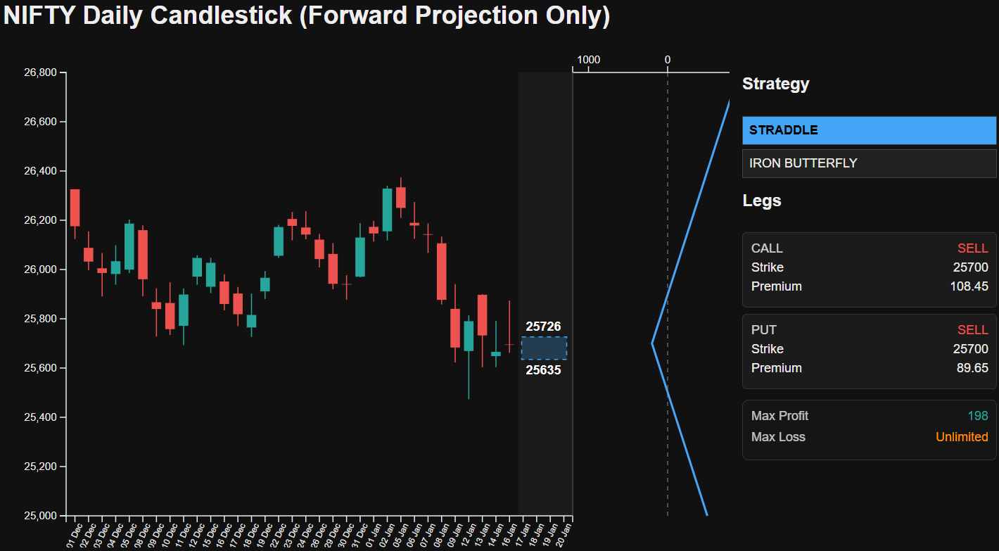
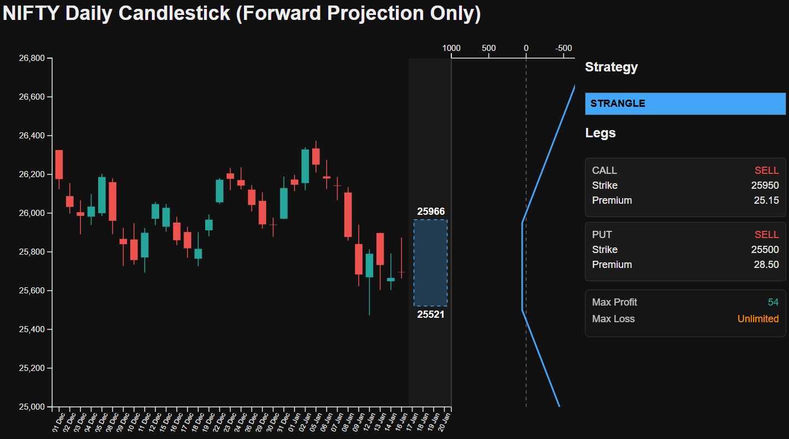

Straddles and strangles are volatility trades disguised as direction-agnostic trades.  
They work when your volatility view is right *and your timing is not embarrassing*.

## Straddle Payoff and Chart



## Why These Strategies Exist at All

They exist because traders need ways to express views on **movement magnitude** rather than direction.

- Long variants buy convexity
- Short variants sell convexity

Everything else is implementation detail and risk management.

## Long vs Short: The Real Tradeoff

A cleaner framing than �risk vs reward� is �path dependency vs terminal dependency.�

- Long straddles/strangles: terminal move must beat premium paid
- Short straddles/strangles: path must avoid violent excursions that break you early

Short vol is rarely �easy.� It is usually just *slow until it isn�t*.

## Strangle Payoff and Chart


## ATM vs OTM: Pay for Precision or Pay for Probability

ATM structures are more sensitive and more expensive. OTM structures are cheaper but need bigger moves.

Use ATM when:

- You expect a meaningful move soon
- You want tighter delta balance

Use OTM when:

- You expect a larger move but want lower upfront premium
- You accept lower responsiveness near spot

## Volatility Expectations and IV Risk

Most straddle mistakes are IV mistakes.

Two recurring traps:

- Buying high IV into known events and eating IV crush
- Selling low IV because �it feels safe� and getting repriced

Your IV view should be explicit before your strike view.

## A Small Payoff Calculator You Can Extend Safely

This keeps the math honest and short.

```python
def long_call(spot, strike, premium):
    return max(0, spot - strike) - premium

def long_put(spot, strike, premium):
    return max(0, strike - spot) - premium

def straddle_payoff(spot, strike, call_prem, put_prem):
    return long_call(spot, strike, call_prem) + long_put(spot, strike, put_prem)

def strangle_payoff(spot, k_put, k_call, put_prem, call_prem):
    return long_put(spot, k_put, put_prem) + long_call(spot, k_call, call_prem)
```

Short variants are just the negative of these payoffs plus execution and risk constraints you cannot ignore.

## Typical Failure Scenarios (That Are Not Theoretical)

- **IV crush**: you were right about direction, wrong about pricing
- **Range traps**: short structures bleed or long structures decay without movement
- **Timing errors**: movement happened, but not in your holding window

Serious traders do not ask �is it profitable on a chart.� They ask �what breaks first when I am wrong.�


