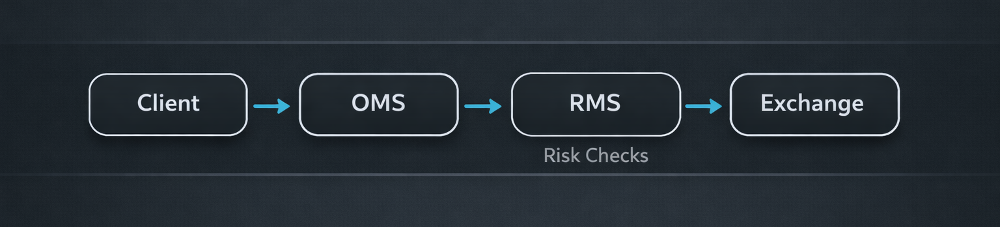

Trading APIs are not a direct line to the exchange.  
They are a controlled entry point into a broker's responsibility surface.

If you're a developer, this matters because the broker's constraints are not friction. They are the product.



## First, What a Trading API Is *Not*

A trading API is not:

- A bypass around broker risk
- A guaranteed execution channel
- A substitute for exchange membership rules

A trading API is an *invitation* to submit intent � subject to broker validation, throttling, and intervention.

## The Order Lifecycle (Client ? OMS ? RMS ? Exchange)

Most order problems become obvious once you think in stages.

### Stage 1: Client Intent Formation

This is where the majority of broken assumptions are born:

- Wrong instruments
- Wrong scaling
- Underspecified order types
- Missing context for baskets and algos

### Stage 2: OMS Normalization

The OMS converts diverse client requests into a broker-controlled internal representation.

This is where brokers impose:

- Field defaults
- Canonical enums
- Broker-level tagging
- Strategy/basket metadata

### Stage 3: RMS Enforcement

RMS is where the broker earns the right to offer APIs at all.

RMS is responsible for answering questions like:

- Should this order be allowed now?
- What is the risk if it partially fills?
- Does it violate broker or exchange controls?

### Stage 4: Exchange Routing and Exchange Reality

After all the internal work, the exchange still decides what fills and when.

From a broker perspective, �routing success� is not success.  
Fill behaviour and post-trade state are what matter.

## Authentication, Rate Limits, Tagging, and Controls

The engineering mistake is to treat these as �API chores.� They are broker controls.

Four controls matter more than most teams admit:

- **Authentication context**: token + device identity is risk context
- **Rate limits**: a market conduct control, not just infra protection
- **Tagging**: the thread that ties audit, strategy, and intervention together
- **Order-type constraints**: broker-level enforcement of exchange reality

A minimal order payload can look deceptively simple:

```python
payload = {
  "ref_id": ref_id,
  "order_type": "ORDER_TYPE_REGULAR",
  "order_qty": qty,
  "order_side": "ORDER_SIDE_BUY",
  "price_type": "MARKET",
  "exchange": "NSE"
}
trade.create_order(payload)
```

The serious work happens *around* this call, not inside it.

## What SEBI Regulates vs What Developers Misunderstand

Developers often misunderstand two things:

1) �If my OPS is low, it isn�t really algo.�  
It is still automated API trading and is treated accordingly.

2) �If a vendor hosts it, the vendor owns it.�  
The broker still owns the responsibility surface.

In regulated markets, responsibility is not assigned by code authorship. It is assigned by market access.

## The Uncomfortable Truth: Brokers Remain Responsible

If you�re building broker APIs, design like you will need to defend every failure mode later.

That changes how you build:

- You prefer determinism over cleverness
- You prefer explicit errors over permissive guesses
- You treat partial fills as a first-class risk state

Trading APIs are not just developer products. They are risk products with a developer interface.


